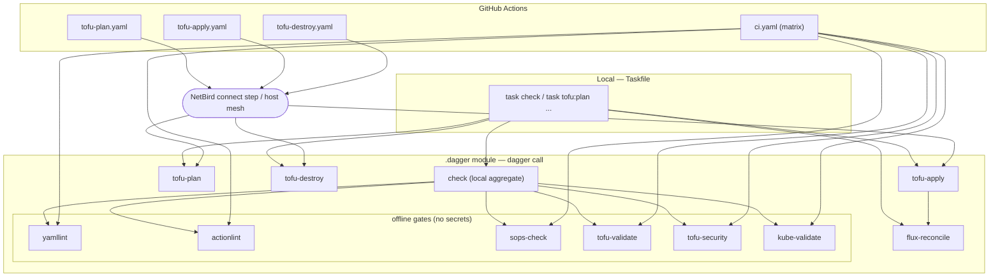

# homelab

GitOps-driven homelab running a [Talos OS](https://www.talos.dev/) Kubernetes cluster on [Proxmox](https://www.proxmox.com/), provisioned with [OpenTofu](https://opentofu.org/) and managed by [Flux CD](https://fluxcd.io/).

## Stack

| Layer | Tool |
|---|---|
| Hypervisor | Proxmox VE |
| OS | Talos Linux |
| Provisioning | OpenTofu (`bpg/proxmox` + `siderolabs/talos`) |
| CNI | Cilium (eBPF, kube-proxy replacement) |
| Storage | TrueNAS CSI (`tns-csi`, NFS + NVMe-oF) + local-path |
| VPN Overlay | NetBird (Operator + Node Extension) |
| TLS | cert-manager + Let's Encrypt |
| Observability | VictoriaMetrics + Loki + OTel Collector + Grafana |
| Security / Policy | Kyverno (Best Practices Pod Security Standards) |
| GitOps | Flux CD |
| Secrets | SOPS + age |
| State Encryption | OpenTofu native AES-GCM |

## Cluster Layout

| Node | Role | vCPU | RAM | Disk |
|---|---|---|---|---|
| master-0/1/2 | controlplane | 2 | 4 GB | 32 GB |
| worker-default-0/1 | worker | 6 | 8 GB | 64 GB |
| worker-large-0 | worker | 12 | 48 GB | 128 GB |

## Repository Structure

```
.
├── tofu/                   # OpenTofu — VM provisioning & Talos bootstrap
└── kubernetes/
    ├── clusters/
    │   └── production/     # Flux entrypoint for your Proxmox/Talos cluster
    ├── infrastructure/      # Cilium, cert-manager
    └── apps/                # Homelab applications (managed by Flux)
```

## Getting Started

### Prerequisites

- `age`, `sops`, `tofu`, `talosctl`, `flux`, `kubectl` installed locally
- Proxmox VE host reachable on the network
- A self-hosted GitHub Actions runner on the same LAN as Proxmox

### 1. Generate Age Key

```bash
age-keygen -o age.key
# Copy the printed public key into .sops.yaml
```

### 2. Configure Secrets

```bash
# Fill in proxmox_api_password and state_encryption_passphrase, then encrypt:
SOPS_AGE_KEY_FILE=age.key sops --encrypt --in-place tofu/secret.sops.yaml
```

### 3. Provision Infrastructure

```bash
export SOPS_AGE_KEY_FILE=age.key
export TOFU_ENCRYPTION_PASSPHRASE_statekey=$(sops -d tofu/secret.sops.yaml | yq .state_encryption_passphrase)

cd tofu
tofu init && tofu apply
```

### 4. Bootstrap Flux

```bash
# Register the age key with the cluster so Flux can decrypt secrets
kubectl create secret generic sops-age \
  --namespace=flux-system \
  --from-file=age.agekey=age.key

flux bootstrap github \
  --owner=<your-github-username> \
  --repository=homelab \
  --branch=main \
  --path=kubernetes/clusters/production \
  --personal
```

## CI / CD

All automation — locally and in CI — runs through a single **Dagger** module in
[`.dagger`](.dagger). Every command executes inside a pinned container, so
`dagger call check` on your laptop is byte-for-byte identical to the GitHub
branch-protection gates. There is no separate shell scripting to drift.

- **Single source of truth for tool versions:** [`.dagger/versions.json`](.dagger/versions.json)
  (`dagger call versions` / `task versions`). Each CLI is copied as a static
  binary out of its pinned upstream image — no `curl`/`unzip`/arch handling.
- **Single source of truth for the engine version:** `engineVersion` in
  [`dagger.json`](dagger.json) — workflows do not re-pin it.
- **Network is configured _before_ Dagger:** the Dagger module is network
  agnostic. Live workflows connect NetBird in a dedicated step first; locally
  you connect your own mesh (`netbird up`) before running live tasks.

### Workflows

| Workflow | Trigger | NetBird | Dagger call |
|---|---|---|---|
| `ci.yaml` | push / PR to `main` | no | matrix: one check per gate (`yamllint`, `actionlint`, `sops-check`, `tofu-validate`, `tofu-security`, `kube-validate`) |
| `tofu-plan.yaml` | push to `main` (`tofu/**`) / manual | yes | `tofu-plan` |
| `tofu-apply.yaml` | manual (protected `production` env) | yes | `tofu-apply` → `flux-reconcile` |
| `tofu-destroy.yaml` | manual + typed confirmation | yes | `tofu-destroy` |

Each offline gate is an independent Dagger function, so CI runs them as a matrix
of separate GitHub checks (granular branch protection + independent re-run).
Locally, run them individually (`dagger call kube-validate`) or all at once
(`dagger call check` / `task check`).

### Pipeline overview



Required secrets/inputs: `SOPS_AGE_KEY` (all live calls), `NETBIRD_SETUP_KEY`
(NetBird connect step), `KUBECONFIG_DATA` (`flux-reconcile`).

---

## Developer and Agent Guidelines

For comprehensive cross-system checklists, custom GitOps conventions (Cilium integration and CloudNativePG storage policies), and rules of engagement (SOPS secrets and validation workflows) designed specifically for human developers and AI coding agents, please refer directly to [AGENTS.md](AGENTS.md).
