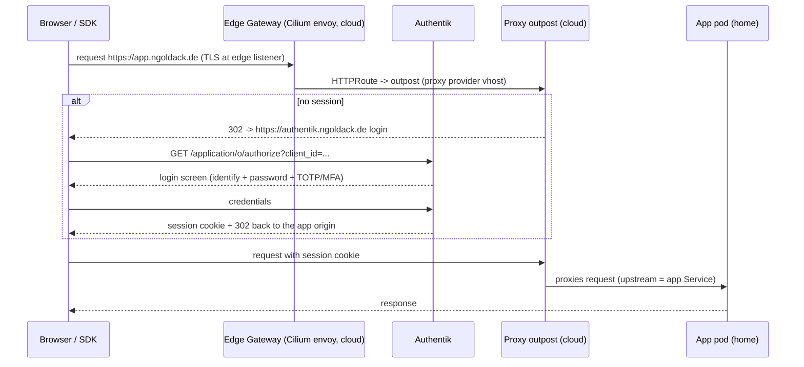
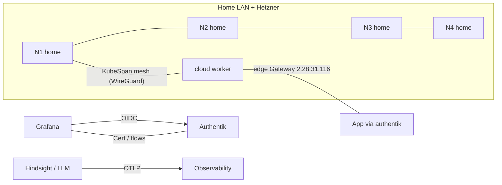

# homelab

A Talos + Cilium homelab: **one** Kubernetes cluster spanning two sites —
Proxmox **home** VMs on the LAN, plus a single Hetzner Cloud worker joined
over Talos KubeSpan. Provisioned with OpenTofu, run by Flux for GitOps.
Services are reached on a LAN LoadBalancer VIP that Cilium announces with
ARP; DNS for it lives in the public Hetzner zone.

- Proxmox hosts declared as a map (`proxmox_nodes`)
- Talos cluster provisioned via OpenTofu (hand-rolled, including the
  Hetzner ingress worker — no registry module)
- Kubernetes bootstrapped with Cilium, owned by tofu
- Secrets stored with SOPS + age
- Flux used as the GitOps layer for everything except the CNI

There used to be a second, independent Hetzner Cloud edge cluster acting
as the sole public ingress point. It was destroyed (commit `bf444f7`);
its former ingress role is now the LAN VIP described above.

## Repository layout

```text
.
├── .sops.yaml
├── .gitignore
├── age.key                  # local only, gitignored
├── README.md
├── Taskfile.yml
├── kubernetes/
│   ├── clusters/
│   │   └── home/             # Flux Kustomization CRs for the cluster
│   └── infrastructure/
│       └── home/              # cert-manager, network (two Gateways: `public`
│                              # on the LAN VIP, `edge` on the Hetzner IP;
│                              # LB-IPAM, L2 announcements), external-dns (two
│                              # scoped instances),
│                              # nvidia, truenas-csi, registry (Zot), buildkit,
│                              # image-builds, immich, cnpg-operator,
│                              # valkey-operator, authentik (+ edge outpost),
│                              # llmkube, monitoring, headlamp,
│                              # talos-backup
└── tofu/
    └── home/                  # Proxmox + Talos + Hetzner ingress, hand-rolled
        ├── main.tf            # Proxmox VMs, ISOs, Image Factory schematics
        ├── talos.tf           # Talos machine secrets/configs
        ├── ingress.tf         # the Hetzner KubeSpan worker (var.cloud_nodes)
        ├── cilium.tf          # tofu-owned Cilium helm_release
        ├── gateway-api-crds.tf# CRDs owned by tofu (ordering fix, see below)
        ├── providers.tf       # s3 state backend + providers
        ├── state-backend.tf   # the state bucket itself
        ├── backups.tf         # the etcd-backup bucket itself
        ├── flux-bootstrap.tf  # flux-system ns + sops-age Secret
        ├── variables.tf / terraform.tfvars
        ├── outputs.tf
        ├── secrets.tf         # loads secret.sops.yaml
        └── secret.sops.yaml
```

## Prerequisites

- `age`
- `sops`
- `tofu`
- `task`
- `jq`
- `kustomize`
- `talosctl`
- `kubectl`
- `flux`
- `helm` (only if you want to render/inspect charts locally before they reconcile)
- access to the Proxmox host, for the LAN nodes
- a Hetzner Cloud account + API token, for the ingress worker, Object
  Storage (state + etcd backups) and the public DNS zone
- a Tailscale account + auth key, as the out-of-band admin path
- `yamllint` (optional; used by `task lint:yaml`)

## Network layout

The home network is split into dedicated VLANs, and the Kubernetes-internal
networks deliberately avoid 10.x so they can never collide with LAN ranges:

| Network              | VLAN | Subnet          | Used by                                  |
| -------------------- | ---- | --------------- | ----------------------------------------- |
| management           | 20   | 10.20.0.0/24    | Proxmox host mgmt, IPMI, access points    |
| server               | 2010 | 10.20.10.0/24   | bare-metal services, NAS, the Proxmox API |
| vms                  | 3000 | 10.30.0.0/24    | Talos VMs (primary NIC, tagged on vmbr0)  |
| k8s pods (internal)  | –    | 172.20.0.0/16   | pod CIDR, cluster-internal only           |
| k8s svc (internal)   | –    | 172.21.0.0/16   | service CIDR, cluster-internal only       |
| svc VIP (vms VLAN)   | 3000 | 10.30.0.200–.250 | LAN LoadBalancer IPs, Cilium L2-announced |

Proxmox host NICs are trunk ports: untagged on management (VLAN 20),
tagged 2010/3000. Talos VMs get a single virtio NIC on the host's VM bridge
with the VM VLAN tag applied by Proxmox.

The VM VLAN ID, subnet prefix, gateway, nameservers and per-node static IPs
live in the public `network` variable in `tofu/home/terraform.tfvars`:

```yaml
network:
  vlan_id: 3000
  subnet_prefix: 24
  gateway: 10.30.0.1
  nameservers:
    - 10.30.0.1
    - 1.1.1.1
  node_ips:
    cp-main: 10.30.0.10
    wk-main-efficiency: 10.30.0.23
    wk-main-performance: 10.30.0.22
```

### Home node roles and capacity

`pmx-main` (i9-13900HX: 8 P-cores/16 threads = "performance", 16 E-cores =
"efficiency", 96 GiB installed / 94 GiB usable) runs a **deliberately
consolidated LAN fleet**: every VM that is not the P100 box shares one
general-purpose worker; the P100 worker also hosts the Kata sandbox
workloads (label-pinned, mixed use).

| node | class | threads | RAM | passthrough | labels/taint |
| --- | --- | --- | --- | --- | --- |
| `cp-main` | efficiency | 4 | 6 GiB | — | control-plane |
| `wk-main-efficiency` | efficiency | 10 (all remaining E) | 28 GiB | Intel UHD 770 iGPU | — (general node) |
| `wk-main-performance` | performance | 16 (0–15) | 48 GiB | Tesla P100, nested KVM (Kata) | no taint; `workload.hermes.io/sandbox=true`, `workload/ai-inference` labels |

Host reserve: 4 GiB RAM + 2 efficiency threads (floor; the fleet totals
82 GiB committed, so the host really keeps ~12 with ARC capped at
1 GiB). E-threads sum to exactly 14/14 — cp 4 + worker 10; P-threads sum to
exactly 16/16 — all on the performance worker. **Adding another node means
taking capacity from an existing one.**

Design of the consolidation:

* The efficiency worker is **untainted on purpose**: it is the only node
  general workloads can run on, so a NoSchedule there would demand a
  toleration from every deployment and isolate nothing. QuickSync consumers
  PULL onto it by capability label — `hardware/igpu: Intel-UHD-Graphics-770`
  (derived by tofu from the `intel-igpu` hostpci mapping) plus
  `workload/media` — e.g. Immich's machine-learning component.
* The P100 worker carries a label-only sandbox pin
  (`workload.hermes.io/sandbox=true`); since the 2026-09-16 merge of the
  old dedicated sandbox worker it also runs the Kata
  Hermes/Agent-Sandbox code-execution sandboxes — every sandbox a Kata QEMU
  microVM with its own guest kernel, needing nested hardware
  virtualization on pmx-main (`kvm_intel.nested=Y`, fleet CPU type is
  already `host`); `task sandbox:preflight` enforces that. The label only
  ATTRACTS sandboxes; there is no sandbox taint, so general and GPU
  workloads still schedule on the node. It is currently **untainted**: the
  `dedicated=nvidia` taint was deleted live on 2026-09-15 so general pods
  could spill onto this node, and the Flux node-taints Job that applied it
  was retired entirely on 2026-09-16 — GPU placement now relies on the
  `workload/ai-inference` label, the nvidia RuntimeClass, and admission
  policies. It runs 48 GiB / 16 P-threads (pre-carve shape): llama.cpp
  offload still fits (27B-Q4 weights ~17 GiB + KV) with headroom — see the
  tfvars comment (the 48 GiB size was kept for proven boot reliability; 64
  GiB starved the host).
* BuildKit is rootless, so the P100 node's machine config raises
  `user.max_user_namespaces` via `machine.sysctls` (Talos ships it at 0 as
  a hardening default; rootless buildkitd refuses to start otherwise).
* VGA-arbitration hazard is handled by the vga rule in `main.tf`: any node
  with hostpci gets `serial0` (no emulated display) — the iGPU-passthrough
  guest once hung at boot with `std` + passed VGA decode concurrently.
* **Every request path stays site-local.** Cross-site pod reachability over
  KubeSpan+VXLAN proved unreliable here (host-netns→remote-pod: dead both
  directions; pod→remote-pod: ~50%), and the gateway data plane is the
  host-netns cilium-envoy DaemonSet. So: `authentik-server` runs 2 replicas
  hard-split one-per-node (anti-affinity; `deploymentStrategy` uses
  maxSurge=0 because a surge pod has no third schedulable node), each site's
  portal route terminates at a same-node `portal-bridge` nginx, and that
  bridge dials `authentik-server-local` (`internalTrafficPolicy: Local`).
  The edge outpost reaches authentik through the same -local Service.
  Anything NEW that must speak cross-site from a gateway path follows this
  bridge pattern until mesh routing is properly fixed.

Host prerequisites applied OUTSIDE this repo (recorded here so a rebuilt
AR900i does not relearn them the hard way): `/etc/systemd/system.conf`
carries `DefaultLimitMEMLOCK=infinity` — Debian's 8 MiB default OOM-kills
`vfio_pin_pages` for any passthrough guest (this bit the iGPU VM's first
boot), and after editing it `systemctl daemon-reexec && systemctl restart
pvedaemon qmeventd` is required — per-VM scopes inherit the default only
from a freshly re-exec'd manager.


Each node in the `nodes` map in `terraform.tfvars` is declared individually
(name, host, `cpu_cores`, optional `cpu_affinity` pin, memory, disk, role).
The `nodes` keys must match the `node_ips` keys — one IP per node; nodes
without an entry fall back to DHCP. If `cpu_affinity` is set, it must span
exactly `cpu_cores` host cores (e.g. `cpu_cores = 6` with
`cpu_affinity = "18-23"`).

The Hetzner ingress worker is a member of the same cluster, so there is
only one set of pod/service CIDRs — cross-site traffic rides Talos KubeSpan
(WireGuard) underneath. Its public IP serves the KubeSpan mesh and the
Tailscale admin path only; service traffic terminates on the LAN VIP (see
"Ingress").

## Secret handling

This repo uses SOPS + age for local secret encryption. Keep credentials and
the OpenTofu state passphrase in `tofu/home/secret.sops.yaml`; non-secret
configuration belongs in `tofu/home/terraform.tfvars`.

1. Generate a local age key:

```bash
age-keygen -o age.key
```

2. Keep `age.key` local and ignored in Git via the repo `.gitignore`.

3. Edit encrypted files with SOPS:

```bash
task sops:edit FILE=tofu/home/secret.sops.yaml
task sops:edit FILE=kubernetes/infrastructure/home/cert-manager/secret.sops.yaml
task sops:edit FILE=kubernetes/infrastructure/home/network/secret.sops.yaml
```

The last two hold Hetzner credentials for cert-manager's DNS-01 solver and
external-dns respectively. Hetzner unified DNS zone management into the
Cloud API in November 2025 (the old standalone DNS Console can no longer
even create zones), so both now take the **same credential type** — a
Hetzner Cloud API token (console.hetzner.com) — and this repo reuses the
same `hcloud_api_token` value already in `tofu/home/secret.sops.yaml` for
both:

| Secret | Consumer | Credential type |
| --- | --- | --- |
| `cert-manager/secret.sops.yaml` (`hetzner`, key `token`) | official `hetzner/cert-manager-webhook-hetzner` | Hetzner Cloud API token |
| `network/secret.sops.yaml` (`hetzner-dns-token`, key `api-token`) | `external-dns-hetzner-webhook` | Hetzner Cloud API token (same value) |

If you'd rather scope DNS access to a separate, narrower token than the one
OpenTofu uses for the ingress worker and Object Storage, create a second
Cloud API token and use that instead — nothing requires reusing the exact
same value, it's just what this repo does by default.

`sops:edit` is the preferred workflow because SOPS creates and removes its
temporary plaintext copy itself. For a persistent local working copy, decrypt
only to an ignored `*.local.yaml` file, then encrypt it back into the tracked
`*.sops.yaml` file:

```bash
task sops:decrypt \
  FILE=tofu/home/secret.sops.yaml \
  OUTPUT=tofu/home/secret.local.yaml

# Edit the ignored local file, then atomically replace only the encrypted file.
task sops:encrypt \
  SOURCE=tofu/home/secret.local.yaml \
  FILE=tofu/home/secret.sops.yaml

rm tofu/home/secret.local.yaml
```

The Taskfile rejects plaintext paths that do not end in `.local.yaml` or
`.local.yml`, rejects encrypted targets that do not end in `.sops.yaml` or
`.sops.yml`, and never decrypts an encrypted file in place. All local working
copies are ignored by Git — remove them once you're done editing, they are
not needed afterward:

```bash
find tofu kubernetes -type f -name '*.local.yaml' -delete
```

To create local working copies for every tracked secret in one operation, run:

```bash
task sops:decrypt:all
```

It creates an ignored sibling for each encrypted file. It refuses to overwrite
any existing local copy and first verifies that all encrypted sources decrypt.

Use `task sops:check:all` to verify every encrypted OpenTofu and Kubernetes
file decrypts. Use `task sops:updatekeys:all` after changing `.sops.yaml`; it
rewrites all encrypted files using the current recipient rules.

`.sops.yaml` scopes two recipient sets: the `tofu/home/` rule (your two
personal keys — `age.key` plus the backup identity) and the broader
`kubernetes/` rule, which adds `home-flux.age.key`, the identity the
in-cluster `sops-age` Secret carries for kustomize-controller. tofu files are
only ever decrypted locally, so Flux's key is deliberately absent from that
rule. There is no CI recipient any more: nothing outside the cluster and the
operator decrypts anything. The CI runner is no exception — it reads its GitHub
PAT from an in-cluster Secret and holds no decryption identity. Print the
remaining recipients with
`task sops:keys:local:public` / `task sops:keys:home-flux:public`.

`tofu/home/secret.sops.yaml` holds, in one place: the state-encryption
passphrase, the Hetzner Object Storage keys (the root owns both its state
bucket and the etcd-backup bucket — see "Remote encrypted state" and
"Talos etcd backups"), the Tailscale auth key, the HCloud API token (ingress
worker + DNS credentials), the Cilium WireGuard API CA, the Proxmox API
token and root@pam password, `home_talosconfig` (see "Talos etcd backups"),
and `talos_backup_age_private_key` — the private half of the age identity
the backup CronJob encrypts snapshots with; only its public key lives in
the cluster (pinned in the CronJob manifest), so a stolen cluster cannot
decrypt its own backups.


## OpenTofu flow

There is a single root, `tofu/home`. It manages the Proxmox VMs, the Talos
cluster they host, and the Hetzner Cloud ingress worker that joins it —
one cluster, two sites, one tofu apply.

### Minimizing Proxmox host (OS) memory reservation

The tofu config pins guest RAM (`memory.dedicated` only, no ballooning) and the
capacity check lets guests consume `max_memory_gb` minus each host's
`reserved.memory` (default reserve: 2 GiB). The OS reservation itself is
**host-level** and not managed by the bpg provider — apply it once per
Proxmox host:

```bash
# Cap ZFS ARC so it cannot grow into guest memory (default can reach ~50% RAM).
# 1 GiB ARC; permanent via /etc/modprobe.d/zfs.conf
echo "options zfs zfs_arc_max=$((1 * 1024**3))" > /etc/modprobe.d/zfs.conf
echo "$((1 * 1024**3))" > /sys/module/zfs/parameters/zfs_arc_max   # live

# Discourage host swapping so the reserve stays free for guests.
sysctl -w vm.swappiness=10
echo "vm.swappiness=10" > /etc/sysctl.d/99-homelab.conf

# Disable KSM page-sharing: it costs host CPU/scan overhead and Talos guests
# share almost nothing, so it rarely pays off here.
systemctl disable --now ksmtuned 2>/dev/null || true
```

The default `reserved.memory = 2` (GiB) assumes a headless host with a capped
ARC. If you skip the ARC cap, raise the reserve (e.g. 4–8 GiB) per host in
`terraform.tfvars` so the host keeps enough for ZFS.

The Home Talos lifecycle lives directly in `tofu/home/talos.tf`, alongside the
Proxmox resources in `tofu/home/main.tf`. From a blank state:

```bash
export SOPS_AGE_KEY_FILE="$PWD/age.key"
task tofu:home:init
task tofu:home:plan
task tofu:home:apply
```

`tofu/home` owns everything: the Proxmox VMs, the Talos
cluster, the Hetzner ingress worker (`ingress.tf`, keyed off
`var.cloud_nodes` — empty by default, so a LAN-only bootstrap works), the
tofu-owned Cilium release, both S3 buckets this cluster needs (state +
etcd backups), and everything Flux needs before it can bootstrap (the
`flux-system` namespace and `sops-age` Secret — see "Flux bootstrap" below).

`task tofu:home:apply` provisions, in one apply: Proxmox VMs from
Image-Factory-built media, Talos bootstrap, the Gateway API CRDs and
Cilium (tofu owns both — see "Flux bootstrap" and "Ingress"), the KubeSpan
peering config that lets the LAN nodes reach the ingress worker through
NAT, the Object Storage buckets, and the `flux-system` namespace/`sops-age`
Secret pair.

**Cost note:** the only billed pieces are the ingress worker itself (a
`cax11`), the reserved primary IP, and the two Object Storage buckets.
There is **no** Hetzner Load Balancer any more — the public Gateway is
backed by a LAN VIP from `CiliumLoadBalancerIPPool`, not a CCM-provisioned
`LoadBalancer`, since Cilium's L2 announcement hands out addresses itself.

## Remote encrypted state

The root stores its state in a dedicated Hetzner Object Storage bucket
(`home-tofu-state-<random>`, via an `s3` backend block pointed at Hetzner's
S3-compatible endpoint) — never shared, never local. State is encrypted
AES-GCM with a SOPS-encrypted PBKDF2 passphrase. OpenTofu's
`encryption { state {...} }` block operates on the state document itself,
before/after it's handed to whichever backend stores the bytes — moving from
local disk to a remote bucket needed **no change** to that block at all.

The Taskfile decrypts the passphrase (and, now, the Hetzner Object Storage
credentials the `s3` backend itself needs — backend blocks can't reference
`var.`/`local.`, so these have to come from `AWS_ACCESS_KEY_ID`/
`AWS_SECRET_ACCESS_KEY` env vars) in memory and passes them to OpenTofu
through temporary environment variables; nothing is ever written to disk or
exported as a persistent shell variable. Before running a Taskfile OpenTofu
command, export the SOPS key:

```bash
export SOPS_AGE_KEY_FILE="$PWD/age.key"
```

Each root's own state bucket is itself a tofu-managed resource
(`state-backend.tf`), which means bootstrapping the root from nothing has
a real chicken-and-egg step: the bucket a backend points at has to exist
*before* that backend can be initialized against it. Resolved with a one-time,
two-step sequence per root — after that, `task tofu:*:init` behaves like any
other remote-backend root forever:

```bash
# 1. Create just the state bucket, before any backend block references it.
tofu -chdir=tofu/home apply \
  -target=aws_s3_bucket.home_tofu_state \
  -target=aws_s3_bucket_versioning.home_tofu_state

# 2. Add/uncomment the backend "s3" {} block in providers.tf with that
#    bucket's now-known literal name (see state-backend.tf's own comment),
#    then migrate:
task tofu:home:init  # or: tofu -chdir=tofu/home init -migrate-state
```

Hetzner's endpoint has real, repeatable
eventual-consistency lag on a brand-new bucket (read-after-create, not just
write-after-create) — if step 1 or 2 fails right after the bucket is created,
wait a short while and retry rather than assuming something is misconfigured;
verify the bucket independently (`aws s3 ls --endpoint-url
https://fsn1.your-objectstorage.com`, or the Hetzner Console) before deciding
otherwise.

The Terraform inputs are intentionally minimal and are centered on:

- independent Proxmox nodes (`proxmox_nodes`: endpoint, token, storage pool,
  ISO datastore, bridge — there is no shared cluster API endpoint)
- cluster name and Talos/Kubernetes versions
- pod/service CIDRs (cluster-internal, non-10.x)
- per-node definitions (host, size, CPU class/affinity, GPU passthrough)

## Flux bootstrap

The cluster comes out of `tofu apply` fully ready for `flux bootstrap` —
nothing manual left to do first. This was not always true, and the two things
that used to require it are worth understanding:

**Cilium.** Talos ships with no CNI, and Flux's own controllers can't
schedule anything without a working one — so *something* has to install
Cilium before Flux ever runs. The cluster solves this by having tofu own
Cilium permanently (`tofu/home/cilium.tf`, a plain `helm_release` resource,
never Flux-managed) — the CNI comes from `tofu apply`, and there is no
`kubernetes/infrastructure/home/cilium/` Flux HelmRelease at all, since
there's nothing left for Flux to adopt.

**The `sops-age` Secret.** Flux needs this Secret to exist in `flux-system`
before it can decrypt anything (`cluster-vars`, `cert-manager`'s DNS
credentials, etc.). The root creates it directly
(`tofu/home/flux-bootstrap.tf`: a `kubernetes_namespace` for `flux-system` +
a `kubernetes_secret` populated from `home-flux.age.key`) —
`flux bootstrap` is idempotent against a pre-existing namespace/secret, so it
just finds both already there.

Both are wired through `kubernetes`/`helm` providers configured directly from
`talos_cluster_kubeconfig`'s own resource attributes (the same
resource-attribute-backed provider pattern the vendored `hcloud-talos` module
already used internally for its own post-bootstrap providers) — so these
resources only get created once the cluster is actually up and its kubeconfig
is known, in the right order, automatically.

With that done, bootstrapping Flux is just:

```bash
KUBECONFIG=kubeconfig-home.yaml flux bootstrap github \
  --owner=<your-user> \
  --repository=<your-repo> \
  --branch=main \
  --path=kubernetes/clusters/home \
  --personal
```

Node taints: the old Flux-managed `node-taints` one-shot Job was retired on
2026-09-16 (its last remaining taint, the sandbox pin, went away when the
dedicated sandbox worker merged into `wk-main-performance`). The P100
worker's `dedicated=nvidia` taint had already been deleted live on
2026-09-15 so general workloads could spill onto it; today no node taint is
applied by any in-repo mechanism — workload placement is purely
label/selector based (`workload/ai-inference`, `workload.hermes.io/sandbox`,
`hardware/igpu`), enforced by the nodeSelector admission policies rather
than taints.

## Minimal cluster contents

- **tofu-owned**: Proxmox VM provisioning, the Hetzner ingress worker, Talos
  machine secrets/configs, an Image-Factory-built boot image per node's
  resolved extension set, the Gateway API CRDs, Cilium (see "Flux
  bootstrap"), and both Object Storage buckets (state + etcd backups).
  Four distinct extension sets are in play — a shared base, base + `i915`
  for the media worker, base + the NVIDIA driver/toolkit for the AI worker,
  and a minimal tailscale-only set for the ingress worker — so each node
  boots the smallest image that serves it.
- **Flux-owned**: everything else — cert-manager + the Hetzner DNS webhook,
  the `network` namespace (public Gateway on the LAN VIP, LB-IPAM pool,
  L2 announcements, wildcard Certificate), external-dns, the NVIDIA device
  plugin (AI worker only),
  TrueNAS-CSI storage classes, Zot (the cluster's own OCI registry), an
  in-cluster BuildKit builder + image-builds, CNPG operator + Immich,
  LLMKube (Qwen on the P100), the monitoring stack, Headlamp, and the
  Talos etcd-backup CronJob.

### System extensions: the ISO is not enough

Getting a Talos extension onto a node takes **two** references to the same
Image Factory schematic, and missing the second one fails silently:

1. `proxmox_download_file.talos_iso` uses `urls.iso` — the boot media.
2. `machine.install.image` (both patch blocks in `talos.tf`) uses
   `urls.installer` — the image that actually writes the system to disk.

The ISO's extensions live only in the live/maintenance boot. Whatever the
*installer* contains is what survives to the installed system, so if
`machine.install.image` is left unset Talos falls back to the stock
`ghcr.io/siderolabs/installer` and every extension is discarded the moment
the node installs and reboots. Nothing errors — the node comes up healthy and
joins the cluster; it just has no `qemu-guest-agent` (so `wait_for_ip` in
`main.tf` times out on every subsequent plan, adding ~10 min and eventually
nulling out `current_ip`), no NVIDIA driver (`KernelModuleSpecController`
retries `module not found` forever), and no `nfs-utils` for truenas-csi.
`urls.installer` is also version-pinned, so it is what makes `talos_version`
govern the installed OS rather than only the generated machine config.

Verify with `talosctl -n <ip> get extensions` — an empty result means the
installer reference is missing. Because this is install-time, changing it on a
running node requires re-running the installer:
`talosctl upgrade --nodes <ip> --image <urls.installer value>` (roll workers
first, control plane last).

## Storage safety policy

TrueNAS-backed dynamic provisioning is intentionally conservative by default:

- NFS shares must never be deleted by default
- NVMe-oF volumes must never be deleted by default
- Dynamic provisioning is allowed to create and expand volumes, but not remove them automatically
- Any destructive cleanup must be explicit and human-reviewed

The storage classes therefore use `reclaimPolicy: Retain` and `forceDelete: "false"` for every TrueNAS-backed class so creating workloads is easy, while accidental data loss is not.

## Topology

One Talos cluster spanning two sites — not two clusters:

- **home**: `pmx-main` (Proxmox, private IPs): control plane + three
  workers (efficiency, media/iGPU, AI/P100)
- **Hetzner site**: a single `cax11` worker with a public IP, joined to the
  LAN control plane over Talos KubeSpan. No control plane, no second etcd.

LAN node-to-node traffic uses KubeSpan purely for transport encryption — it
does not carry pod-to-pod traffic (that stays with Cilium's own VXLAN
overlay; see `advertiseKubernetesNetworks` in `tofu/home/talos.tf`). For the
Hetzner worker KubeSpan *is* the underlay: all four LAN nodes sit behind one
NAT and cannot accept inbound, so they dial out to it and UDP 51820 must stay
open on its firewall (see `tofu/home/ingress.tf`). There is no ClusterMesh —
with one cluster there is nothing to mesh with.

Services are reached on a LAN LoadBalancer VIP (`10.30.0.200`, pinned on the
Gateway, from the pool in
`kubernetes/infrastructure/home/network/lb-ipam.yaml`), ARP-announced by
Cilium's L2 announcements restricted to `topology.homelab/site=home` — the
Hetzner worker is on a different L2 segment and can never answer for it,
which is also why Envoy no longer runs host-network there (see "Ingress").

## Validation

Before pushing, check the structure:

```bash
task check   # yamllint + tofu fmt + kustomize builds + sops decrypt
```

which is the aggregate of `task lint:yaml`, `task lint:tofu`,
`task lint:kustomize` and `task sops:check:all`. Add
`task tofu:home:validate` when you touch the tofu tree.

Running `task check` locally before pushing is still on you — it is the
pre-merge gate, and CI does not re-run it.

What CI does is the deployment side. `.github/workflows/flux-reconcile.yml`
runs on a self-hosted runner inside the cluster
(`kubernetes/infrastructure/home/github-runner/`, registered for this
repository only) on every push to `main`, and performs the `flux reconcile`
that used to be typed by hand: it forces a fetch of the GitRepository,
reconciles the root Kustomization, nudges every child, then waits for all of
them to be Ready — so a merge converges in seconds instead of waiting out the
10m poll interval, and fails loudly if reconciliation does not converge. The
wait is not a bare Ready check: an already-Ready Kustomization would satisfy
one before the new revision was ever applied, so the workflow first waits for
the revision this run fetched to be what every Kustomization last applied
(`status.lastAppliedRevision`), and only then for Ready — a green run means the
merge is actually live, not merely that nothing is currently broken.
Trigger it by merging, or manually with
`gh workflow run flux-reconcile.yml`.

Because the runner lives in the cluster, no laptop needs a kubeconfig. Its
ServiceAccount (`ci-runner`) may only patch Flux objects in `flux-system`, and
the workflow deliberately does not run on pull requests: the runner has
cluster-side authority and a readable PAT, so untrusted code must never execute
on it.

That PAT is a fine-grained token under `Administration: Read and write` in
`kubernetes/infrastructure/home/github-runner/secret.sops.yaml`; it expires
2026-12-17. The day it does, the runner stops registering (a CrashLoop with
"no registration token returned by GitHub") until the Secret is updated —
`task sops:edit FILE=kubernetes/infrastructure/home/github-runner/secret.sops.yaml`
and then `kubectl -n github-runner delete pod -l app.kubernetes.io/name=github-runner`.
The former GitHub Actions etcd-backup workflow is gone; see "Talos etcd
backups".

Common workflows are wrapped in the Taskfile (`task --list`):

| Task                                    | Purpose                                  |
| --------------------------------------- | ---------------------------------------- |
| `task setup`                            | Create the local age key, print env      |
| `task sops:edit FILE=<path>`            | Edit any SOPS-encrypted file safely      |
| `task sops:decrypt FILE=<file> OUTPUT=<local>` | Create an ignored plaintext working copy |
| `task sops:decrypt:all`                 | Create ignored working copies for all secrets |
| `task sops:encrypt SOURCE=<local> FILE=<file>` | Atomically encrypt a working copy       |
| `task sops:check:all`                   | Verify every encrypted file decrypts     |
| `task sops:updatekeys:all`              | Rekey every encrypted file               |
| `task tofu:home:init` / `plan` / `apply` / `destroy` | OpenTofu lifecycle        |
| `task kubeconfig:home:export`           | Write the cluster kubeconfig             |
| `task talosconfig:home:export`          | Write the cluster talosconfig            |
| `task talos-backup:home:bucket`         | Print the generated backup bucket name   |
| `task lint:yaml` / `lint:tofu` / `lint:kustomize` | Structure checks           |
| `task check`                            | Run all of the above                     |

---

## Developer notes

This repo intentionally stays small and opinionated:

- keep only the bootstrap path required to bring up Talos + Cilium
- add storage and application layers only when they are needed by the cluster
- keep secrets encrypted with SOPS + age and never commit plaintext API keys
- prefer explicit human review for destructive actions such as deleting storage

If you need to add a workload later, add it in a single, purpose-built layer rather than reintroducing broader platform scaffolding.

## Ingress

Public names, one answer everywhere: the public Hetzner zone is the single
source of truth. `headlamp`, `authentik`, `grafana` resolve to
`2.28.31.116` (the Hetzner edge worker) for every client — LAN included —
and pass authentik at the edge outpost before touching the cluster.
`immich` and `registry` resolve to `10.30.0.200` — a LoadBalancer VIP on
the cluster VLAN, announced with ARP by Cilium — reachable only on the LAN;
from the internet they are black holes by design, and what public DNS buys
is resolver independence (DoH clients, UniFi Teleport, IPv6 clients on the
ISP's resolver, and plain LAN clients all get the same answer; this is what
killed the old "turn Encrypted DNS off on the UDM" workaround). The stated
cost is unchanged: service hostnames and the internal VIP are publicly
enumerable; the wildcard certificate keeps individual names out of CT logs.

No router-side DNS configuration exists or is required — the earlier
split-horizon resolver (`internal-dns/`, CoreDNS at `.201`) and the UDM
conditional forward were retired 2026-09-13 so that LAN clients need zero
per-name or per-zone maintenance on the router.

Traffic path:

```text
LAN / Internet: client → Hetzner DNS → 2.28.31.116 → Cilium Gateway (`edge`)
             :443 → authentik edge outpost (session check) → home pod via
             KubeSpan
LAN only:     client → Hetzner DNS → 10.30.0.200 → Cilium Gateway (`public`)
             :443 → HTTPRoute → pod   (immich, registry — no auth hop)
```

### Authentication — how SSO reaches every app (authentik)

Authentik is the single identity provider and edge authorizer. Two distinct
paths exist, and an app takes exactly one:

| Path | Apps | How login works |
| ---- | ---- | ---- |
| **Edge outpost (proxy)** | headlamp, grafana (UI), hindsight-ui | browser hits the edge Gateway → the Rust **proxy outpost** (pin to the Hetzner cloud node) checks the authentik session, redirects unknown users to the authentik login flow, then proxies to the app's pod over KubeSpan |
| **OIDC federation** | grafana | the app's own login page redirects to authentik (`/application/o/authorize`), authentic validates, returns a code, the app exchanges it at `/application/o/token/` for an id token + access token (no outpost in the path) |



- Envoy is an ordinary **pod**, not a host-network bind:
  `gatewayAPI.hostNetwork.enabled` is `false` in `tofu/home/cilium.tf`. It
  used to be on, binding 443 on the Hetzner worker — from that host network
  namespace Envoy could not reach pods on the LAN nodes at all (every Immich
  request 503'd with a healthy backend), and it crossed the WAN twice for a
  service in the same room as the client. The flag is global with no
  per-Gateway override: turning it back on breaks the VIP.
- `externalTrafficPolicy: Local` (also in `cilium.tf`): cilium-envoy runs on
  every node including the Hetzner one; under `Cluster` policy the
  VIP-receiving node load-balanced across all Envoys and roughly one request
  in five landed on the Hetzner one — which answers 503 for the same
  host-netns reason. `Local` also preserves the client source IP.
- The VIP is allocated by `CiliumLoadBalancerIPPool`
  (`network/lb-ipam.yaml`, `10.30.0.200-250`), pinned to `.200` on the
  Gateway via `lbipam.cilium.io/ips` because every published DNS record
  points at it, and announced by `CiliumL2AnnouncementPolicy`
  (`network/l2-announcement.yaml`) restricted to
  `topology.homelab/site=home` — the Hetzner worker sits on a different L2
  segment and could never answer ARP for it. Leadership is per-service and
  Lease-backed, so the VIP fails over between home nodes. (The old
  `nmap -p 443` "no stray binds" check is meaningless since Envoy stopped
  using host networking.)
- TLS terminates on the Gateway with wildcard certs (`*.svc.<domain>`,
  `*.<domain>` and the apex) issued by cert-manager via Let's Encrypt
  **DNS-01** through `cert-manager-webhook-hetzner`. The webhook targets the
  **new** Hetzner Cloud DNS API (`api.hetzner.cloud/v1/zones`) — the legacy
  `dns.hetzner.com` endpoint now 301s to HTML, so any client still pointed
  there gets a web page instead of JSON.
- external-dns (`infrastructure/home/external-dns/`) publishes an A record
  per hostname on every HTTPRoute attached to the Gateway, via the
  `external-dns-hetzner-webhook` sidecar (also migrated to the new API —
  check the pinned webhook version carries `hcloud-go/v2` zone support
  before bumping). Scoped to the zone apex, `gateway-httproute` source only
  (no `service` source: publishing stays an explicit act), `policy: sync`
  with a `reg-*` TXT ownership registry so deleting an HTTPRoute removes its
  record while touching nothing else in the zone.
- Only namespaces labeled `gateway.ngoldack.de/public-ingress=true` may
  attach an HTTPRoute to the public Gateway — nothing is labeled by default.
- The Hetzner worker keeps a public firewall rule for 443 and runs Cilium's
  Envoy DaemonSet pod like every node, but since hostNetwork is off nothing
  binds its public 443 any more — see "Known limitations".

### Cilium is owned by tofu, permanently

Talos starts with no CNI, so `tofu/home/cilium.tf` installs Cilium as a real
`helm_release` during `tofu apply` — before Flux exists, since Flux's own
controllers cannot schedule until a CNI does. This is deliberate and
permanent: there is **no** Flux `HelmRelease` for Cilium. To upgrade, bump
`cilium_version` / `cilium_values` in `tofu/home/cilium.tf` and re-apply;
Flux manages every other workload but never touches `kube-system`'s CNI.

The Gateway API CRDs are also tofu-owned (`tofu/home/gateway-api-crds.tf`,
a vendored chart, with `helm_release.cilium` `depends_on` it). That is the
fix for the failure that ate a whole cluster here: `cilium-operator` probes
for the Gateway API CRDs exactly once at startup and treats a miss as
permanent, and on the old cloud cluster the Flux-owned CRDs landed ~24
minutes after the operator started — so the Gateway silently never became
Accepted while every Kustomization stayed green. Same-graph ordering now
holds on a from-scratch rebuild, and `gatewayAPI.gatewayClass.create` is set
to the string `"true"` explicitly because client-side rendering can never
satisfy the chart's `"auto"` capability check. There must be exactly **one**
owner of these CRDs: a second owner doing server-side apply with prune can
cascade-delete every Gateway and HTTPRoute.

The vendored bundle and the Cilium chart are a **lockstep pair**: Cilium
1.20's operator unconditionally indexes `TLSRoute` **v1** and its Gateway API
support requires Gateway API **v1.6.1 minimum** (the mirror image of the
1.19.5-era crash, where the operator indexed `TLSRoute` v1alpha2 and died when
a newer standard bundle dropped it). The **experimental channel** is now
mandatory, not a matter of taste: it is the only v1.6.1 bundle that still
serves `TLSRoute` v1alpha2 (installing v1.6 *standard* orphans any v1alpha2
objects in etcd), and the `ExternalAuth` HTTPRoute filter (GEP-1494) that
Cilium 1.20 implements — the edge-authz hook the authentik plan uses — exists
only there. Against standard-channel CRDs the API server **silently prunes**
the filter field and a route meant to be protected reconciles **unprotected**.
Bump one without the other and the operator crash returns; the chart's
`Chart.yaml` records the full reasoning, including why the standard→experimental
swap lands before the bundle's new `safe-upgrades` admission policy exists to
object.

### Edge ingress: one authenticated path with authentik

Every client, LAN included, reaches `headlamp`, `authentik`, `grafana`
through the same door:

| Client | Resolves to | Path |
| ------ | ----------- | ---- |
| All (LAN, VPN, internet) | `2.28.31.116` (Hetzner primary IP) | edge Gateway → cilium-envoy on the ingress node → authentik edge outpost (session check; login redirects to the portal) → home pod over KubeSpan. |
| LAN only | `10.30.0.200` (LAN VIP) | internal Gateway (`public`) → app pod, no auth hop — only for the LAN-only names (immich, registry). |

Pieces: `network/edge.yaml` (cloud LB-IPAM pool + second Gateway), the
`authentik/` stack (server+worker on CNPG+valkey-operator at home, Rust
proxy outpost pinned to the Hetzner node via `nodeSelector`/toleration),
per-Gateway namespace labels (`public-ingress` vs `edge-ingress`), and
external-dns instance scoping via `--gateway-name` (one instance per Gateway —
`--gateway-label-filter` proved unusable, see
`kubernetes/infrastructure/home/external-dns/helmrelease.yaml`) so an edge
route can never overwrite a LAN record. Edge exposure per app = its own
edge HTTPRoute (see `headlamp/httproute-edge.yaml`); authentik resources are
seeded declaratively from `/blueprints` (`authentik/seed.yaml`).

Two external-dns instances write the public zone and can never collide on a
record:

- **Edge instance** (`external-dns/helmrelease-edge.yaml`,
  `--gateway-name=edge`): publishes the edge routes' hostnames — headlamp,
  authentik, grafana — to the Hetzner IP.
- **LAN instance** (`external-dns/helmrelease.yaml`, `--gateway-name=public`
  + `--label-filter=dns.ngoldack.de/publish=lan`): publishes only the
  LAN-only names (immich, registry) at `.200` — unreachable from the
  internet by design.

The earlier split-horizon design (in-cluster CoreDNS resolver at `.201` +
UDM conditional forward + `publish=twin` internal routes) was retired
2026-09-13: it required router-side config to function, and IPv6 clients on
the ISP's resolver bypassed it anyway. One public answer per name is now the
invariant; the router needs zero DNS configuration.

A proxy provider only gets an outpost vhost if an Application *owns* it —
the seed binds `grafana-proxy` to its own `grafana-edge` app for exactly
that reason; without the app the outpost silently falls back to its default
provider for every host.

## Talos etcd backups

`kubernetes/infrastructure/home/talos-backup/` runs the official
`ghcr.io/siderolabs/talos-backup` image as an in-cluster CronJob
(daily 03:17 Europe/Berlin, `concurrencyPolicy: Forbid`) that snapshots etcd
and uploads it to the `home-talos-etcd-<suffix>` Object Storage bucket
(created by tofu, `tofu/home/backups.tf`).

This replaced `.github/workflows/talos-etcd-backup.yml`, which never produced
a single successful backup. Its fatal defect was environmental: every CI run
joined the tailnet as a **new** ephemeral device needing manual admin-console
approval, so it could never run unattended. In-cluster removes the tailnet
hop entirely — the CronJob reaches the local Talos API directly, with no node
IP or hostname to keep in sync, and is pinned to the home site
(`topology.homelab/site: home`) since the 2 GiB Hetzner worker has no business
holding two full snapshots in scratch space.

Authentication is Talos-native, not copied credentials: a
`ServiceAccount.talos.dev` (Talos's own service-account CRD) issues the pod a
short-lived talosconfig mounted at
`/var/run/secrets/talos.dev/config` — `TALOS_HOME=/tmp` + `TALOSCONFIG` are
set explicitly because the binary's path resolution dies when `$HOME` is
unset. Only the S3 credentials are a SOPS Secret
(`talos-backup-s3-credentials`).

Snapshots are **age-encrypted before upload** — the cluster has no
secrets-at-rest encryption, so a raw etcd snapshot contains every Secret in
plaintext. The private half of that age identity is deliberately NOT in the
cluster (that would defeat the purpose): it lives in
`tofu/home/secret.sops.yaml` as `talos_backup_age_private_key` and is
required to restore. The CronJob manifest pins only the public key. Objects
land as `etcd-<UTC timestamp>.snapshot`.

Hetzner Cloud's OpenTofu provider does not manage Object Storage buckets, so
the root uses the maintained AWS provider against Hetzner's S3-compatible
API — for the backup bucket *and* the state bucket (see "Remote encrypted
state"). Before the first apply, create an Object Storage access key for
`fsn1` in the Hetzner Console and put it in `tofu/home/secret.sops.yaml`:

```yaml
hetzner_object_storage_access_key: <access-key>
hetzner_object_storage_secret_key: <secret-key>
```

Both buckets are versioned and `prevent_destroy`. Neither has a
lifecycle/expiration policy: `aws_s3_bucket_lifecycle_configuration` cannot
be applied against Hetzner's endpoint (a confirmed upstream provider bug —
see the comment above `home_talos_backups` in `tofu/home/backups.tf`), so
snapshots accumulate forever until a policy is set manually via the Hetzner
Console or `aws s3api put-bucket-lifecycle-configuration`.


### Bootstrap order

1. Populate `tofu/home/secret.sops.yaml`: state passphrase, Object Storage
   keys, `hcloud_api_token`, `tailscale_auth_key`, the Proxmox API token and
   root@pam password (see "Secret handling" and "Talos etcd backups").
2. Add the same Hetzner Cloud API token to the `cert-manager` and `network`
   encrypted Secrets (see the table in "Secret handling") — reuse
   `tofu/home/secret.sops.yaml`'s `hcloud_api_token`, or a separate,
   narrower-scoped token if you'd rather not share one.
3. Bootstrap the root's remote state bucket (see "Remote encrypted
   state"), then `task tofu:home:apply` — this brings up the whole cluster:
   LAN VMs, the Hetzner ingress worker (skip by leaving `cloud_nodes = {}`),
   Cilium, and the `sops-age` Secret Flux needs (see "Flux bootstrap").
   Nothing manual in between.
4. Bootstrap Flux at `kubernetes/clusters/home` (see "Flux bootstrap" — no
   pre-steps needed).
5. Export the talosconfig and store it in the sops file for backup
   restores:

   ```bash
   task talosconfig:home:export
   sops --set '["home_talosconfig"] '"$(python3 -c 'import json,sys;print(json.dumps(open("talosconfig-home.yaml").read()))')" \
     tofu/home/secret.sops.yaml
   ```

   (The CronJob itself does not need this — it gets its talosconfig from the
   Talos `ServiceAccount` — but `talosctl` restore drills do.)

### Verification

- `kubectl --context home get nodes` shows all five nodes Ready (four LAN +
  the Hetzner worker), and `kubectl -n kube-system get pods -l k8s-app=cilium`
  shows tofu's own Cilium release healthy.
- `flux get all` shows every Kustomization/HelmRelease Ready.
- KubeSpan: `talosctl -n <lan-ip> get meshconfig` lists the ingress peer as
  `Ready` — the three LAN-to-Hetzner peerings are dial-out only.
- Certificate: `kubectl get certificate -n network` shows the wildcard
  Ready.
- Gateway: `kubectl get gateway -n network public` shows Programmed with
  `10.30.0.200`.
- DNS: `dig <app>.<domain>` → `10.30.0.200` for the LAN-only names and
  `2.28.31.116` for the edge names, from any resolver (DoH included —
  that's the point); `kubectl logs -n network deploy/external-dns` and
  `deploy/external-dns-edge` show the two scoped syncs.
- TLS end-to-end: `curl -v https://<app>.<domain>` from the LAN presents the
  Let's Encrypt cert.


## Known limitations / follow-ups

- **Talos/node upgrades**: bumping `talos_version` regenerates machine configs
  and images but does not upgrade running nodes in place — use
  `talosctl upgrade` / `talosctl upgrade-k8s`. On the Hetzner worker,
  `hcloud_server` sets `lifecycle { ignore_changes = [user_data, image] }`
  precisely so a config edit never REPLACES the server (the initial config
  rides on `user_data` at first boot; every later push goes through
  `talos_machine_configuration_apply` proxied over KubeSpan). A new
  schematic means a deliberate `tofu apply -replace` / reinstall from the
  new installer image — extensions are install-time only (see "System
  extensions").
- **Firmware/chipset**: every home VM uses `machine = "q35"` + `bios = "ovmf"`
  (with the required `efi_disk`), deliberately uniform across the fleet
  rather than only on the PCIe-passthrough node. Every VM also gets a
  `serial0` socket with `vga { type = "serial0" }`: once a passed-through
  GPU's driver (e.g. `i915`) loads, it takes over the emulated display, and
  Proxmox's own Console tab would otherwise freeze on the last framebuffer
  frame — pointing the console at the serial port keeps it live for every
  node, not just the one with PCIe passthrough.
- **Headlamp**'s ServiceAccount is bound to `cluster-admin` and the app has
  no native OIDC: its only path is the edge route, so the authentik outpost
  gates every access — `headlamp/httproute-edge.yaml` proxies to the home
  pod only after a valid session.
- **LAN clients of edge names hairpin**: `headlamp`/`authentik`/`grafana`
  resolve to the Hetzner IP for everyone, so a LAN browser pays one in-country
  WAN round trip plus the authentik session check. This is the accepted cost
  of zero router-side DNS configuration. The edge instance publishes A
  records only — IPv6-only mobile clients need the Hetzner primary IPv6 +
  AAAA before they can reach edge names at all.
- **Insecure TLS to the Proxmox API** (`insecure = true` by default) trusts
  Proxmox's typical self-signed certificate; if you've issued a real one,
  set `insecure = false` per host in `proxmox_nodes`.
- **Registry rate limiting**: some Hetzner IP ranges hit container registry
  rate limits; if image pulls start failing on the Hetzner worker, this is a
  known cause — another reason build output goes to the in-cluster Zot
  registry rather than GHCR.
- **No `tofu plan` should show drift on the Hetzner worker any more.** The
  old `tofu/cloud` root was permanently dirty: the `hcloud-talos` module
  hard-coded `alias_ips = []` while Talos claimed the control-plane VIP on
  that interface at runtime (`hetznercloud/terraform-provider-hcloud#650`),
  so every plan wanted to strip it and applying briefly broke the
  endpoint. The destroyed root is gone, and the hand-rolled `ingress.tf`
  has no equivalent — a non-empty plan here is now a real finding, not
  noise to read past.
- **Vestigial bits on the ingress worker** (candidates for a follow-up
  cleanup, deliberately left because touching them is a live apply on a
  `NoSchedule`-tainted node nothing depends on): the firewall's public 443
  rule and its "sole public entry point" comment in `ingress.tf` predate
  hostNetwork being turned off — nothing binds that port any more; and
  `cp-main` still carries `siderolabs/tailscale` for the retired GitHub
  Actions backup job, which is now just an admin path. The two old
  `cloud-*` Object Storage buckets (state + etcd backups, both verifiably
  empty) were also left in place: deletion is irreversible and they cost
  nothing.
- **Talos can never self-apply a node taint — this repo doesn't use
  `machine.nodeTaints` at all any more.** Talos does not pass taints through
  kubelet's `--register-with-taints`; `k8s.NodeApplyController` patches
  labels *and* taints onto the Node object afterwards, using the kubelet's
  own identity. Kubernetes' NodeRestriction admission plugin forbids a node
  from setting its own taints, so that patch is rejected — and because
  labels ride the same atomic patch, **the node also gets none of its
  labels**. This affects every node carrying `nodeTaints`, including
  brand-new ones (verified: `wk-main-media` hit it on its very first join,
  not just already-registered nodes).

  `tofu/home/talos.tf` therefore never sets `machine.nodeTaints` at all, and
  since 2026-09-16 no in-repo mechanism applies node taints (the Flux
  `node-taints` Job was retired with the sandbox worker merge). Workload
  placement is label/selector based — if a future taint is needed again, it
  must be re-introduced as a Flux Job or applied manually, because a node
  still can't taint itself. Symptom to remember: a node that's `Ready` but
  has only the five stock `kubernetes.io/*` labels means its
  `NodeApplyController` patch was rejected — check
  `talosctl -n <ip> logs controller-runtime | grep NodeApplyController`
  (should be quiet when no taints are configured).
- **A new tailnet device needs manual approval before it's reachable at
  all.** Every node running the `siderolabs/tailscale` extension (the
  Hetzner ingress worker, and `cp-main`) sits in `ext-tailscale`'s
  restart-forever loop — `talosctl -n <ip> logs ext-tailscale` shows
  `machineAuthorized=false`, `NeedsMachineAuth` — until you approve it in the
  Tailscale admin console. This is unrelated to whether the auth key itself
  is valid; it happens on every first join, cluster rebuild included.
