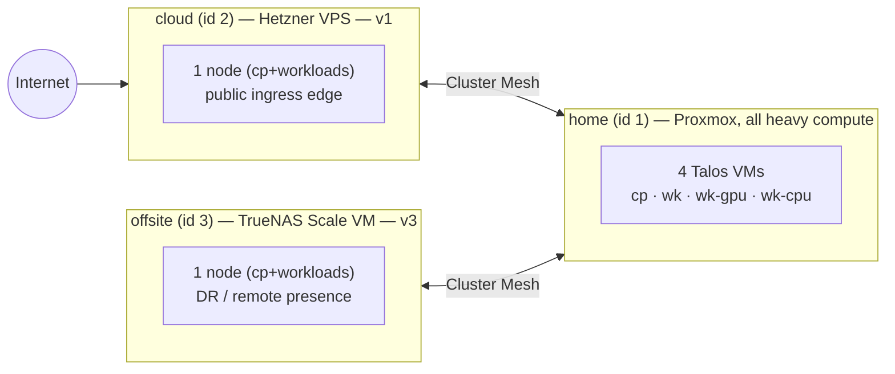
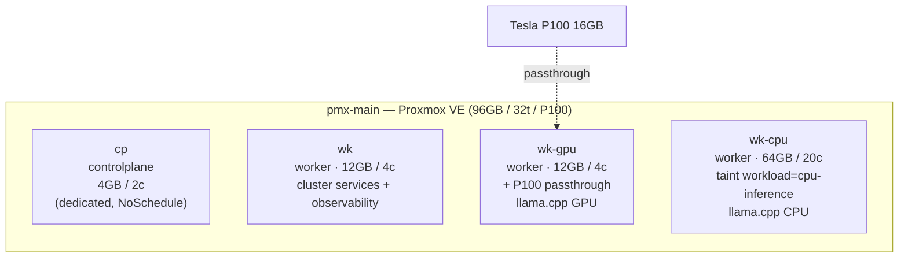
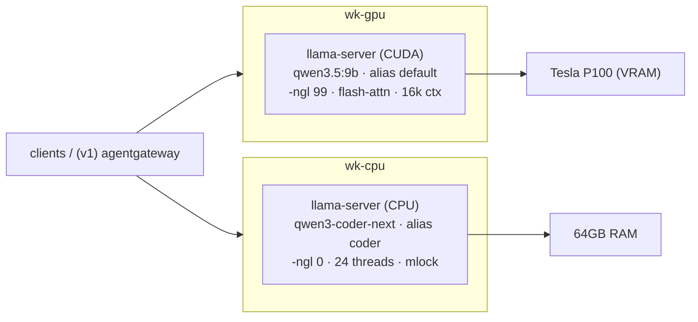
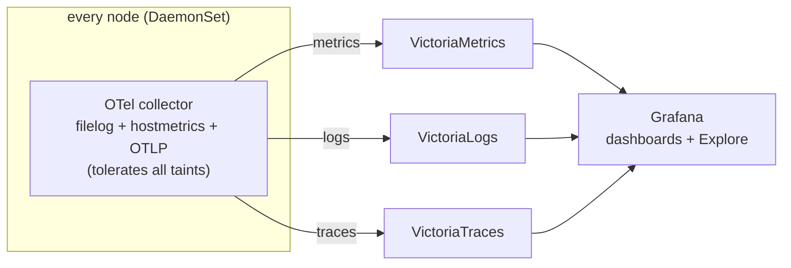
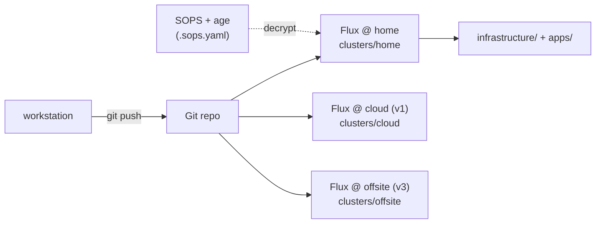
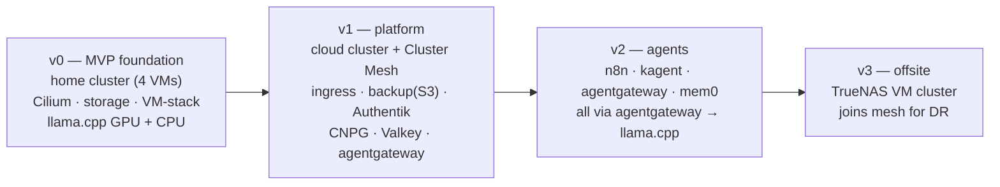

# Homelab Architecture

A lean, **phased** self-hosted AI platform: Talos Kubernetes + Flux GitOps +
Cilium, serving LLMs via **llama.cpp** on a Tesla P100 (GPU) and a dedicated CPU
node. Delivered as a multi-cluster system joined by Cilium Cluster Mesh.

> **Source of truth:** the plan lives in [`openspec/`](../openspec/) — each phase
> (v0–v3) is an OpenSpec change with proposal / design / specs / tasks. This
> document is the human-readable overview; the specs are authoritative.
>
> **Conventions:** GitOps-first (one Flux per cluster), secrets are SOPS/age
> encrypted (`*.sops.yaml`), all live ops run from the workstation. See
> [AGENTS.md](../AGENTS.md).

---

## 1. Clusters & Cluster Mesh

Three **independent** Talos/Cilium clusters joined by **Cilium Cluster Mesh**
(unique `cluster.id`/`name`, shared CA, `clustermesh-apiserver`). Separate
clusters — not one stretched cluster — because the links are WAN/untrusted and
the cloud/offsite boxes are tiny; a stretched control plane over the internet is
fragile, meshed independent clusters are not.



| Cluster | Phase | Host | Role |
|---|---|---|---|
| **home** (id 1) | v0 | Minisforum AR900i (Proxmox) | all heavy compute (LLMs, observability) |
| **cloud** (id 2) | v1 | 1 Hetzner VPS | public ingress edge + Hetzner S3 backups |
| **offsite** (id 3) | v3 | 1 TrueNAS Scale VM (6GB) | DR / remote presence |

Cross-cluster traffic uses **global services** (`service.cilium.io/global: "true"`):
e.g. a cloud ingress route targets a home Service over the mesh. home is
built **mesh-ready** in v0; cloud + the actual mesh land in v1.

---

## 2. home cluster — node topology

Four Talos VMs on the single Proxmox host `pmx-main` (Minisforum AR900i, 96GB /
32 threads, 1× Tesla P100). Talos is always a Proxmox VM (never bare-metal); the
P100 is PCIe-passed-through to `wk-gpu`.



- **cp** — dedicated control plane, not schedulable.
- **wk** — general worker; runs the VictoriaMetrics stack, Grafana, Cilium
  operator, etc.
- **wk-gpu** — has the P100 (NVIDIA driver/toolkit Talos extensions + kernel
  modules ship **per-pool on this node only**). Runs the GPU chat model.
- **wk-cpu** — dedicated, tainted; runs the large CPU coder model in 64GB RAM.

All networking is **Cilium** (kube-proxy replacement, Gateway API, Hubble,
WireGuard node encryption, LB-IPAM). Talos CNI = `none`, kube-proxy disabled.

The nodes sit on a **dedicated VLAN-tagged subnet** (`10.30.0.0/24`, VLAN 3000 on
`vmbr0`), isolated from the management LAN, with **static IPs** (`cp` `.10`, `wk`
`.11`, `wk-gpu` `.12`, `wk-cpu` `.13`; gateway `.1`). The router owns the VLAN
gateway + a maintenance-DHCP scope for the Talos install-ISO boot; the installed
nodes use the static addresses. Subnet, VLAN, gateway, DNS and per-node IPs are
tofu variables (`k8s_*` + `node_pools[*].ip_addresses`).

---

## 3. Model serving — llama.cpp

llama.cpp (chosen over vLLM, which dropped Pascal, and Ollama) serves
OpenAI-compatible APIs. Two models, two nodes:



- **GPU (wk-gpu):** `qwen3.5:9b` fully offloaded to the P100, Pascal-tuned
  (flash-attention, FP16, continuous batching).
- **CPU (wk-cpu):** `qwen3-coder-next`, mlock'd into 64GB RAM, 24 threads.
- Weights persist on a `tns-fast-nfs` PVC (no re-download on restart). Both
  expose Prometheus `/metrics`.
- In **v1**, **agentgateway** fronts both behind stable aliases (`default`, `coder`,
  `embeddings`) so consumers never reference a concrete model. Future: the
  dual-P100 `ai-host` for `qwen3.6:35b` + optional LMCache.

> Model names `qwen3.5:9b` / `qwen3-coder-next` are placeholders for the intended
> models; current Qwen GGUFs stand in until they exist.

---

## 4. Storage tiers (home — TrueNAS CSI)

Pick the tier per workload:

| Tier | StorageClass | Use |
|---|---|---|
| `fast` | `tns-fast-nvmeof` | NVMe-oF block — **only** where it materially helps (databases) |
| `standard` | `tns-fast-nfs` | fast pool over NFS — **default** for everything (weights, monitoring) |
| `storage` | `tns-tank-nfs` | HDD pool over NFS — huge media libraries only |
| `local` | `local-path` | node-local — tmp/scratch only |

The cloud/offsite single-node clusters use `local-path` (the TrueNAS tiers are
LAN-only).

---

## 5. Observability — the VictoriaMetrics stack

One ecosystem end-to-end (no Loki/Tempo): metrics, logs, and traces all on
VictoriaMetrics-family stores, viewed in Grafana.



- A single **OTel collector** DaemonSet (tolerates every taint, so cp/gpu/cpu
  nodes are covered) ships metrics → **VictoriaMetrics**, logs → **VictoriaLogs**
  (LogsQL), traces → **VictoriaTraces** (OTLP).
- **Grafana** has all three as datasources + cluster-overview dashboards;
  aggregated logs via Explore / LogsQL.

---

## 6. GitOps & secrets



- **One Flux per cluster** — each cluster bootstraps its own Flux pointing at its
  `clusters/<name>/` entrypoint and reconciles a subset.
- **Secrets:** SOPS + age; every secret is a `*.sops.yaml` encrypted in place
  (key anchored in `.sops.yaml`). Flux decrypts at apply time.
- **tofu/** provisions the Proxmox VMs (home) and the Hetzner cluster (v1);
  the offsite TrueNAS VM is created by hand (no provider).
- **Validation (workstation/CI):** `kustomize build` + `kubeconform -strict`,
  `yamllint`, `tofu validate`, `task sops:check`. Conventional Commits.

### Repo layout

```
clusters/<name>/         Flux entrypoints (home; cloud=v1; offsite=v3)
infrastructure/
  controllers/           operators, CNI/CSI, observability (home)
  configs/               cluster-wide config
  cloud/   (v1)          minimal cloud-cluster infra (Cilium id 2 + mesh + Gateway)
apps/<app>/              flat, one dir per app (v0: llama-cpp)
tofu/locations/<loc>/    OpenTofu per location (home=Proxmox; cloud=v1; offsite=v3)
openspec/                the phased plan (v0–v3)
```

---

## 7. Phase roadmap



| Phase | Adds |
|---|---|
| **v0** | home cluster (cp/wk/wk-gpu/wk-cpu); Cilium; 4 storage tiers; VictoriaMetrics+Logs+Traces+Grafana; llama.cpp (GPU `qwen3.5:9b` + CPU `qwen3-coder-next`). Cilium is built **mesh-ready**. |
| **v1** | the **cloud** cluster (Hetzner VPS) + **Cilium Cluster Mesh**; public ingress; backups → Hetzner S3; Authentik (SSO); CloudNativePG + Valkey operators; **agentgateway** in front of llama.cpp. |
| **v2** | n8n, kagent, agentgateway, mem0 — wired **agentgateway → llama.cpp** (no model redeploy). |
| **v3** | the **offsite** cluster (TrueNAS Scale VM) joined to the mesh for disaster recovery / remote presence. |

Synergy is deliberate: each phase reuses the prior layers — `n8n / kagent →
agentgateway → llama.cpp`; embeddings and memory ride the same model
layer; nothing re-deploys a model server.
