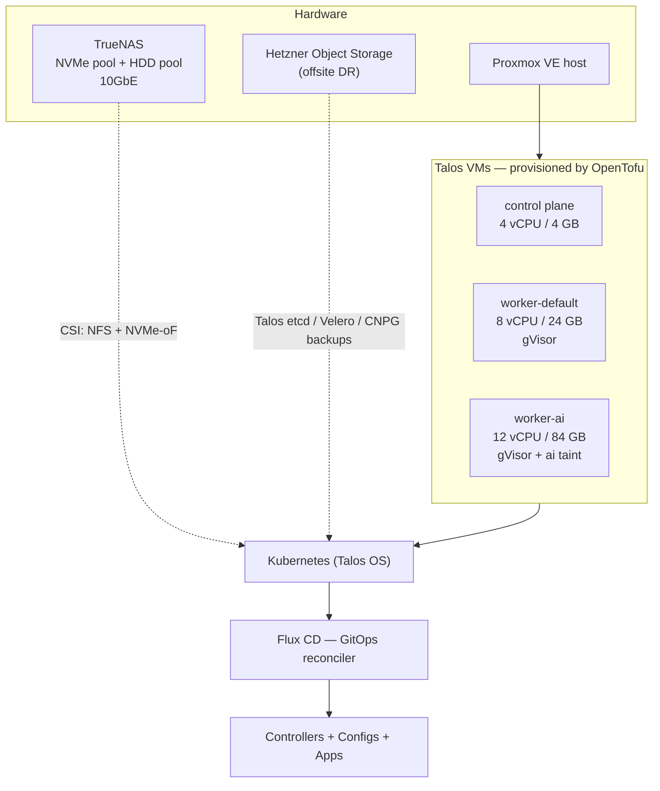
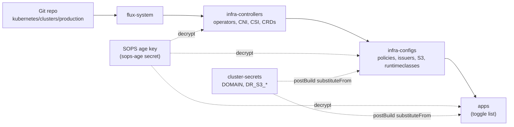
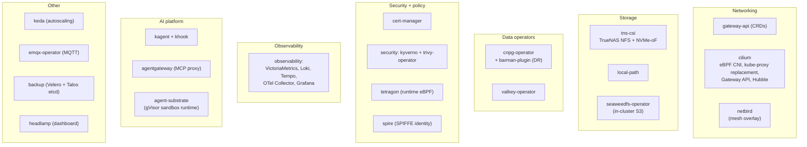
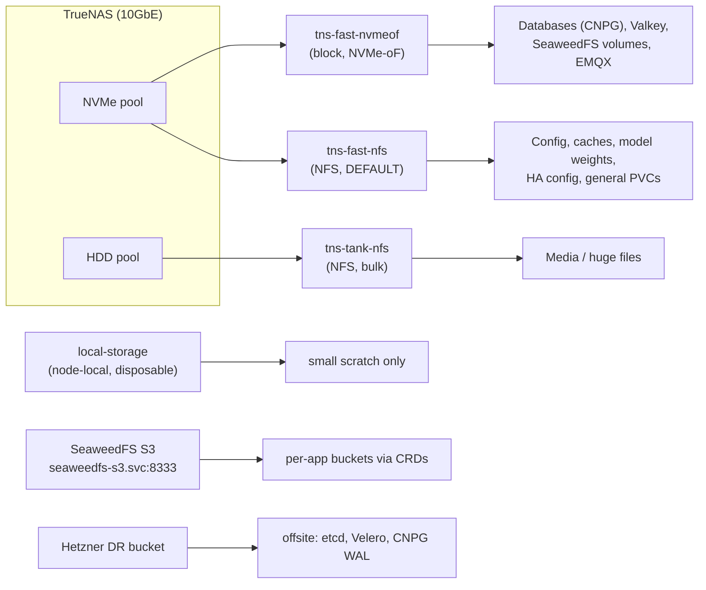
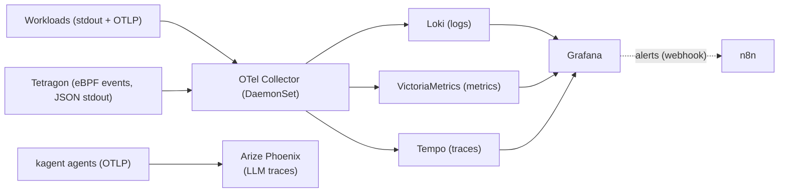
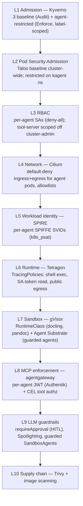
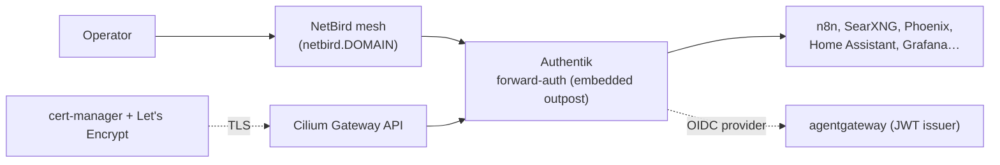
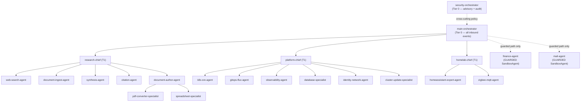
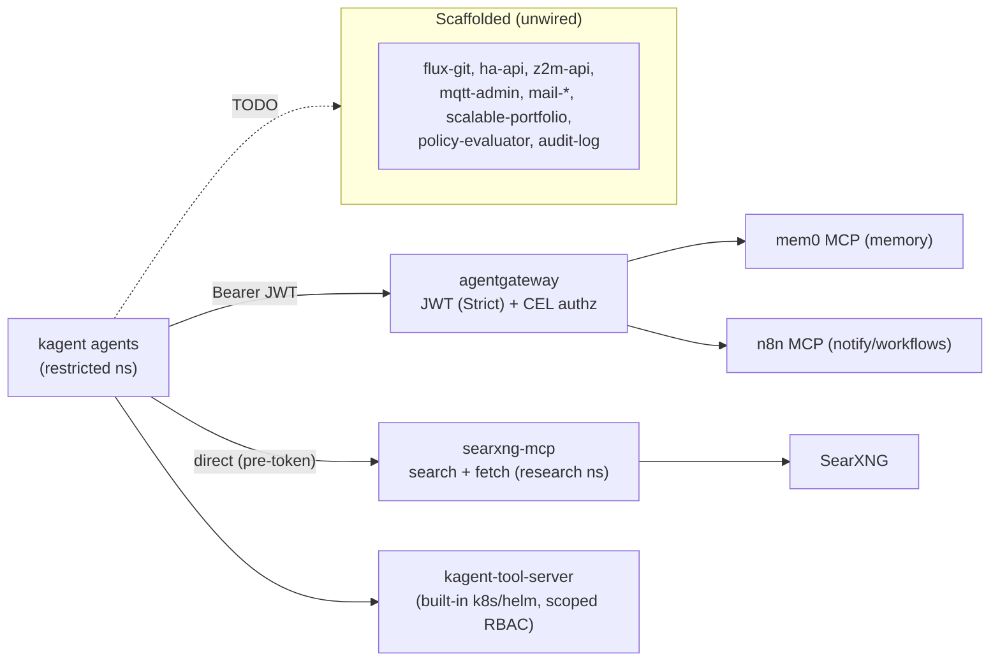
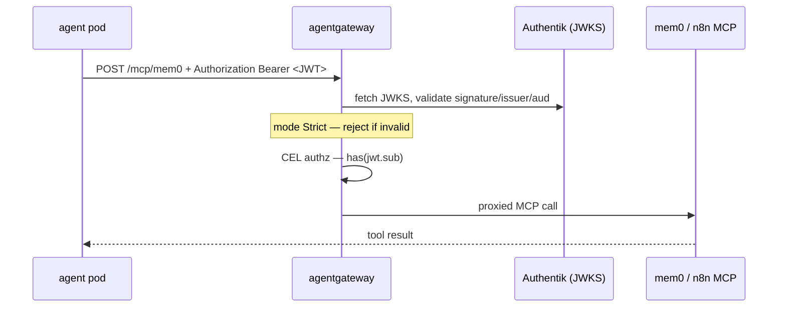

# Homelab Architecture

End-to-end documentation of every moving part: from Proxmox VMs up through the
GitOps delivery chain, the platform operators, the security stack, and the AI
agent / deep-research system.

> Conventions: this repo is GitOps-first (Flux), secrets are SOPS/age encrypted,
> CI lints only, and all live operations run from the workstation via `Taskfile`.
> See [AGENTS.md](../AGENTS.md) for the engineering rules and
> [apps/kagent/README.md](../kubernetes/apps/kagent/README.md) for the agent
> subsystem deep-dive.

---

## 1. Physical → logical stack



OpenTofu (`tofu/`) provisions the VMs via `bpg/proxmox`, renders Talos machine
configs via `siderolabs/talos`, and stores its state **encrypted in Git**
(native AES-GCM, passphrase in `tofu/secret.sops.yaml`). Node pools are a single
`map(object)` in `tofu/variables.tf` (counts are configurable; the gVisor system
extension + `user.max_user_namespaces` sysctl are baked into the worker pools).

---

## 2. GitOps delivery (Flux dependency order)



Three Flux `Kustomization`s chain by `dependsOn`: **infra-controllers →
infra-configs → apps**. All three decrypt SOPS; `infra-configs` and `apps` also
substitute `${DOMAIN}` / `${DR_S3_*}` from the `cluster-secrets` secret.

---

## 3. Repository layout

```text
homelab/
├── tofu/                      # OpenTofu: Proxmox VMs, Talos config, encrypted state
│   ├── variables.tf           # node_pools map(object); Hetzner DR; extensions
│   ├── talos.tf               # machine config patches (CNI=none, gVisor sysctl…)
│   └── secret.sops.yaml       # proxmox pw + state passphrase (SOPS)
├── kubernetes/
│   ├── clusters/production/   # Flux entrypoints (infra-controllers/configs/apps)
│   ├── infrastructure/
│   │   ├── controllers/       # operators + central sources.yaml (HelmRepositories)
│   │   └── configs/           # cluster-wide config that depends on controllers
│   └── apps/                  # one dir per app; kustomization.yaml is the toggle
│       └── _components/       # shared kustomize components (cnpg-barman-backup)
├── docs/                      # this file, roadmap, disaster-recovery
└── .github/workflows/ci.yaml  # lint-only CI
```

---

## 4. Infrastructure controllers (operators)



HelmRepositories are centralised in
`infrastructure/controllers/sources.yaml`; every `HelmRelease` references one by
name (no inline chart URLs).

---

## 5. Storage tiers



Per-app Postgres (CloudNativePG) and Valkey instances are **never shared** — each
app gets its own + credentials. S3 buckets/users are provisioned per-app via
SeaweedFS CRDs (`S3Identity` + `S3Credentials` + `Bucket`).

---

## 6. Observability & audit pipeline



Tetragon runtime-security events flow stdout → OTel filelog → Loki (alertable in
Grafana → n8n). LLM agent traces go to Phoenix via OTLP gRPC `:4317`.

---

## 7. Security — defense in depth



Secrets are SOPS/age throughout. The full hardening table + accepted gaps live in
[apps/kagent/README.md](../kubernetes/apps/kagent/README.md).

---

## 8. Identity & external exposure



Apps are reached over the **NetBird mesh** (not the public internet) behind
**Authentik** forward-auth. Authentik is also the **OIDC issuer** for
agentgateway's MCP JWTs.

---

## 9. AI agent system (kagent)



22 agents (20 `Agent` + 2 `SandboxAgent`). `main-orchestrator` delegates only to
the three chiefs; guarded agents are kept out of every toolset (unreachable).
Triggers (`khook`) fire `main-orchestrator` on cluster events
(CrashLoopBackOff/OOMKill/Flux failures).

---

## 10. MCP tool topology



Only **mem0**, **n8n**, **searxng-mcp**, and the built-in **kagent-tool-server**
are wired. mem0/n8n route through agentgateway (JWT — inert until the Authentik
token is minted); `searxng-mcp` is direct so the research pipeline works now. The
rest are flagged `RemoteMCPServer` scaffolds, referenced by no agent.

---

## 11. Deep-research pipeline (Perplexity-style)

```mermaid
sequenceDiagram
  autonumber
  participant U as User / n8n / khook
  participant MO as main-orchestrator
  participant RC as research-chief
  participant WS as web-search-agent
  participant SX as searxng-mcp
  participant DI as document-ingest
  participant SY as synthesis-agent
  participant CT as citation-agent
  participant DA as document-author
  U->>MO: research question
  MO->>RC: delegate
  RC->>RC: expand into 3-7 sub-questions
  par parallel sub-searches
    RC->>WS: sub-question
    WS->>SX: searxng_web_search + web_url_read
    SX-->>WS: results + page content
    WS-->>RC: structured sources
  end
  RC->>DI: ingest URLs/docs (web_url_read; docling later)
  RC->>SY: synthesize (context/evidence/analysis/conclusion)
  RC->>CT: verify claims + add citations
  RC->>DA: author deliverable (Pandoc/Gotenberg)
  DA-->>U: cited report (DOCX/PPTX/PDF)
```

A turnkey alternative — **gpt-researcher** (`apps/research`, Apache-2.0) — runs
the same plan→search→synthesize→report loop autonomously over our SearXNG + Ollama,
exposed as a REST engine (wiring it into `research-chief` needs the `gptr-mcp`
wrapper — TODO).

---

## 12. agentgateway MCP enforcement (status)



**Integration status:** structurally complete and Flux-ordered correctly
(CRDs in `infra-controllers` before the CRs in `apps`), but **not yet functional**
— JWT `mode: Strict` + a placeholder bearer means MCP-through-gateway is rejected
until a real Authentik client-credentials token is minted into
`mcp-gateway-token` (or set `mode: Permissive` for staged rollout). Field shapes
(`AgentgatewayPolicy`, tool-name passthrough, the cross-ns `ReferenceGrant`) carry
`VERIFY-BEFORE-DEPLOY` notes.

---

## 13. Applications (the `apps/` toggle)

| App | Purpose | Notable backing services |
|---|---|---|
| `authentik` | Identity / SSO / OIDC | CNPG, Valkey, SeaweedFS (media) |
| `ollama` | LLM serving (GPU, OpenAI-compatible) | 3x P100, LiteLLM, PVC (models) |
| `litellm` | Central model-alias layer | ollama |
| `asr` | Speech-to-text (Qwen3-ASR) | 1x P100 (transformers backend) |
| `searxng` | Meta-search (JSON enabled) | — |
| `n8n` | Workflow automation / Signal notify | CNPG, Valkey |
| `mem0` | Agent long-term memory (pgvector) | CNPG |
| `phoenix` | LLM trace observability | CNPG |
| `kagent` | AI agent fleet (22 agents + MCP) | LiteLLM, mem0, n8n, searxng-mcp |
| `agentgateway` | MCP JWT + CEL enforcement | Authentik (OIDC) |
| `research` | Deep-research backend | mcp-searxng + gpt-researcher |
| `mqtt` | EMQX broker (3-node) | — |
| `homeassistant` | Home automation | EMQX |
| `zigbee2mqtt` | Zigbee bridge | EMQX, coordinator |
| `gotenberg` / `docling` / `pandoc` | Document convert / parse / generate | gVisor (docling, pandoc) |

Enable/disable an app by adding/removing its line in
`kubernetes/apps/kustomization.yaml`.

---

## Validation

```bash
kustomize build kubernetes/infrastructure/controllers
kustomize build kubernetes/infrastructure/configs
kustomize build kubernetes/apps
kustomize build kubernetes/clusters/production
yamllint -c .yamllint kubernetes/
task sops:check
cd tofu && tofu init -backend=false && tofu validate
```
