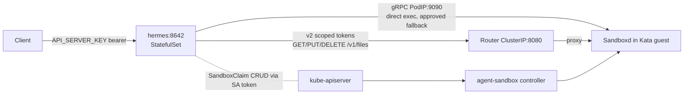

# Hermes Agent + Kubernetes Agent Sandbox

Production-minded Hermes Agent deployment: every model-generated terminal
command executes inside a Kubernetes Agent Sandbox Pod (kubernetes-sigs/
agent-sandbox v1.0.2, SIG Apps) on the dedicated Kata worker
`wk-main-sandbox` (Proxmox VM `wk-main-sandbox`, 6 vCPU / 12 GiB, nested
virt, `siderolabs/kata-containers` extension).

## Architecture



Layers (Flux dependencies in this order):
`agent-sandbox` (controller + Router + admission + policies) →
`hermes-sandbox` (namespace, RuntimeClass `kata`, `hermes-go`
template/warm pool, Cilium) → `hermes` (gateway).

### Trust model and the two documented design decisions
- **Claim RBAC (user-approved):** the sandbox-router (Go, v1.0.2) proxies to
  already-adopted sandboxes and has no claim API, so the gateway's SDK
  creates/deletes its own SandboxClaims via the Kubernetes API. The `hermes`
  SA gets a Role in `hermes-sandbox` ONLY: `sandboxclaims`
  (create/get/list/watch/delete) + `sandboxes` (get). No pods, no secrets,
  no exec/port-forward, no cluster scope.
- **Direct gRPC exec (user-approved):** v1.0.2 sandboxd exposes execution
  only as gRPC ProcessService on podIP:9090 (REST is `/v1/files`,
  `/v1/health`, `/v1/metadata`); the Go Router is HTTP-only, so Router
  exec does not exist. The plugin executes via plaintext gRPC to the
  adopted pod. Cilium admits pod→sandbox 9090 only from the `hermes` and
  `agent-sandbox-system` namespaces; claim ownership is the trust boundary.
  File transfer keeps the intended Router path (v2 scoped tokens).

## Bootstrap / deploy order

1. `task sandbox:preflight` (nested-virt on pmx-main) — must pass.
2. Tofu worker + machine config (labels/taints) — `tofu apply` in `tofu/home`.
3. Commit/push; Flux reconciles: `agent-sandbox` → `hermes-sandbox` →
   `hermes`.
4. Plugin/gateway image builds: one-shot buildkit Jobs in
   `kubernetes/infrastructure/home/image-builds/` (see Upgrade below).

## Operation

- **Interaction path (v1):** private OpenAI-compatible API server,
  `hermes:8642`, bearer `API_SERVER_KEY`. No public route, no messaging
  platform.
  ```bash
  curl -H "Authorization: Bearer $API_SERVER_KEY" \
    -H 'Content-Type: application/json' \
    -d '{"model":"deepseek/deepseek-v4-flash","messages":[{"role":"user","content":"…"}]}' \
    http://hermes.hermes.svc:8642/v1/chat/completions
  ```
- **Acceptance:** `hack/hermes-e2e.sh` (API auth gate, Go task through the
  sandbox, claim/pool cleanup); `hack/hermes-plugin-integration.sh` for the
  plugin live suite (exec assertions need `AGENT_SANDBOX_IN_CLUSTER=1`).
- **Kata smoke:** `task kata:smoke`.

## Secrets inventory & rotation

| Secret | Where | Rotation |
|---|---|---|
| `OPENROUTER_API_KEY` | `hermes/secret.sops.yaml` (stringData) | values.sops, restart pod |
| `API_SERVER_KEY` | same Secret | `openssl rand -hex 32`, restart pod |
| `AGENT_SANDBOX_ROUTER_TOKEN` | same Secret, **`data:`** (raw 32 B seed) | new seed → derive pubkey → update `agent-sandbox/router-auth-keys.yaml` (`kid: hermes-1`) → rollout Router → update Secret → verify `wc -c /opt/data/router-token` == 32 |

The token file must stay base64-encoded under `data:` — a `stringData`
entry would mount the 44-char text and crash `Ed25519.from_private_bytes`.

## Upgrade / rebuild (gateway + runtime images)

Build Jobs pin the repo commit SHA as build context, so an image rebuild is:
1. Commit the change (plugin/dockerfile).
2. Bump the Job name suffix + context SHA + tag in
   `image-builds/hermes-agent-sandbox-plugin.yaml` (or
   `hermes-sandbox-runtime.yaml`), commit, push.
3. Apply the Job, wait for completion, read the pushed digest from its log.
4. Repin the image digest in the StatefulSet/SandboxTemplate, commit, push.
5. Flux applies; verify curator gate (`hermes plugins list`, `hermes doctor`,
   e2e).

Renovate is not configured in this repo; pinning + digest updates are
manual per the steps above.

### Upgrade-hermes (Hermes base image)
Bump `FROM docker.io/nousresearch/hermes-agent` in the plugin Dockerfile,
verify the plugin's import paths against the new layout (`agent.*` at
v2026.9.7; `hermes plugins compat` inside the image), rebuild per above.

### CRD/stack upgrades (agent-sandbox)
`upstream/sandbox-with-extensions.yaml` is vendored verbatim (see its
README for tag + sha256). Kustomize patches carry all local changes. Treat
CRD upgrades as manual-review (v1beta1); validate with `kubectl explain`
before adopting new fields.

## Rollback
1. `git revert` (or checkout) the offending commit — never force-push.
2. If a claim/sandbox storm is in progress: scale the warm pool to 0
   (`kubectl -n hermes-sandbox scale sandboxwarmpool hermes-go --replicas=0`),
   delete stray claims.
3. If the gateway misbehaves: `kubectl -n hermes rollout undo statefulset/hermes`.
4. Confirm via `hack/hermes-e2e.sh`.

## Troubleshooting

| Symptom | Check |
|---|---|
| Gateway pod CrashLoop: s6 preinit | Image must ENTRYPOINT the hermes shim directly (s6 cannot run as uid 10000); rebuild if missing |
| `Unknown TERMINAL_ENV 'agent_sandbox'` | Plugin not registered: `hermes plugins list` inside the pod; entry point must name the MODULE (`register(ctx)` on it) |
| 403 on sandboxclaims | Pod is not using SA `hermes` (`serviceAccountName`), or RoleBinding missing |
| Claim created but exec fails | Warm pool down (`sandboxwarmpool` replicas); sandbox ingress policy; gRPC port 9090 reachable only from `hermes`/`agent-sandbox-system` |
| Model calls fail ("offline") | hermes egress: Cloudflare CIDR rule (104.18.0.0/15, 172.64.0.0/13:443); kube-apiserver egress for claims |
| `router-token` wrong size | Must be exactly 32 bytes; token under `data:` (base64), not stringData |
| Sessions run LOCAL despite `terminal.backend: agent_sandbox` | A hermes-generated `config.yaml` from an early boot (no terminal key) can shadow the operator config; the seed initContainer only replaces a MISSING file (`[ -f ] \|\| cp`), so fix once by removing the stale file and rolling. Verify `hermes config get terminal.backend` == `agent_sandbox` (TERMINAL_ENV=agent_sandbox is the hard override) |
| Desktop connects then WS drops (~1s) | Dashboard couldn't persist config (`os.replace` EBUSY on a read-only config mount) — config.yaml must live on the PVC (seeded by initContainer), never a mounted ConfigMap |
| Sandbox `go test` fails "read-only file system" on build cache | Runtime image must set `HOME=/tmp` (writable emptyDir); runtime ≥1.0.3 has it |
| `task check` fails | `yamllint`/`tofu fmt`/`kustomize`/sops — run at repo root with `SOPS_AGE_KEY_FILE` set |

## Capacity
One warm + one active sandbox maximum (node 6 vCPU / 12 GiB; sandbox
limits 4 CPU/5 GiB). Warm pool `replicas: 1`. To support concurrency,
raise the VM RAM first (plan: 12 GiB, then 24 GiB), then re-derive the
limits — never raise replicas without the RAM.

## Backup
`data-hermes-0` PVC (10 GiB, `truenas-fast-nfs`) is covered by the repo's
NAS snapshot policy (see README "Storage safety policy"); restore = create
a PVC from the snapshot and point the StatefulSet's `volumeClaimTemplates`
selector at it. Sandbox emptyDirs, warm-pool pods and runtime caches are
never backed up.

## Known gaps (tracked, deliberate)
- **No alerting yet** — the monitoring stack vendors no rules by design
  ("deliberate, visible gap" in `monitoring/helmrelease.yaml`). When the VM
  operator + vendored VMRules land, add: sandbox node NotReady, warm pool
  unavailable >10m, claims stuck Pending/Terminating, hermes crashloop,
  Router auth failures, sandbox→management-network drops.
- **`toFQDNs` is inert in this cluster** — the Cilium DNS proxy has
  transparent mode off (split-horizon DNS conflict, `tofu/home/cilium.tf`),
  so FQDN egress rules never learn IPs. The hermes model egress uses
  OpenRouter's anycast CIDRs instead. The sandbox stack's
  github.com/proxy.golang.org `toFQDNs` rules share this inertness; a
  coding task that needs module downloads must first switch those to CIDRs
  or route through an internal mirror.
- **`write_file`/`read_file` on sandbox paths** — HERMES_WRITE_SAFE_ROOT
  defaults to /opt/data, so host-side file tools cannot reach
  `/workspace`; the model writes files through the terminal instead.
  Upload via `PUT /v1/files` + `HERMES_WRITE_SAFE_ROOT=/workspace` is the
  follow-up.
- **No Renovate** — pin/digest updates are manual (see Upgrade).