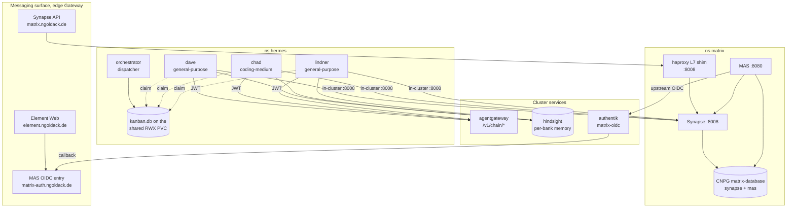

# Multi-Agent Hermes + Self-Hosted Matrix

Operator + design document for four coordinated Hermes agent processes
(`orchestrator`, `dave`, `chad`, `lindner`) on a self-hosted Matrix homeserver
(Synapse + Matrix Authentication Service + Element Web), with Authentik SSO,
Hermes Kanban for durable delegation, Hindsight for per-agent memory, and the
agentgateway for all LLM traffic.

Manifests: `kubernetes/infrastructure/home/matrix/` (the homeserver),
`kubernetes/infrastructure/home/hermes-agents/` (the agents), wired by
`kubernetes/clusters/home/matrix.yaml` and
`kubernetes/clusters/home/hermes-agents.yaml`. Everything here was read out of
those files; where a design intent and a manifest disagree, the manifest is
what the cluster does and this page describes the manifest.

## Architecture



Three properties the diagram encodes:

- **Agents never traverse the Gateway.** The bots call Synapse on the
  in-cluster Service (`http://matrix-synapse.matrix.svc.cluster.local:8008`).
  The Cilium allowlist admits `hermes -> matrix:8008` and nothing else, so the
  public listeners exist for the human (Element Web through Authentik) and for
  external Matrix clients, not for the agents.
- **The board is the agent-to-agent surface, not Matrix.** The orchestrator
  owns `kanban.db`; the three messaging agents only read and claim from it.
- **Every LLM call goes through the agentgateway chains.** No agent holds an
  upstream provider credential.

## Trust boundaries and per-profile capability

The four processes run the same image
(`registry.ngoldack.de/hermes-agent-sandbox-plugin@sha256:6fc70c64…`) with the
same pod hardening (non-root 10000, `RuntimeDefault` seccomp, all capabilities
dropped, read-only root filesystem) and the same ServiceAccount (`hermes`).
What differs is the profile config, and that config is the security boundary:

| Boundary | Mechanism | Where |
| --- | --- | --- |
| Which messaging identity a process can assume | one process per profile; `HERMES_PROFILE` + `HERMES_HOME` pin it, and Hermes binds platform credentials per process at startup | `hermes-agents/*.yaml`, `configmap.yaml` |
| Which plugins load at all | `plugins.enabled` per profile | `configmap.yaml` |
| Whether the profile can execute code | `terminal.backend` + the presence of the `agent_sandbox` plugin, and the profile's `toolsets` (lindner: `safe, memory, session_search, todo, clarify, kanban` — no terminal, no code execution, no file tools) | `configmap.yaml` |
| Which LLM chains it can reach | provider `base_url` paths + `chad`'s extra override providers | `configmap.yaml` |
| Which memory bank it reads/writes | `HINDSIGHT_BANK_ID` + that bank's API key | `hermes-agents/*.yaml`, `secret.sops.yaml` |
| Network reachability | `hermes-agents-default-deny` + `hermes-agents-allowlist` for every agent, and `hermes-agents-sandbox-allowlist` only for pods labelled `hermes.ngoldack.de/sandbox: "true"` — lindner carries `"false"`, so the sandbox Router, the gRPC exec port, the API server and the package mirrors are unreachable for it | `cilium-policy.yaml`, `hermes-agents/*.yaml` |
| Sandbox isolation for every model-authored command | Kata microVM via `agent_sandbox`, admitted only through `hermes-go` | `hermes-sandbox/` |

The deny-all baseline (`hermes-agents-default-deny`) selects
`app.kubernetes.io/name: hermes-agents`, which is deliberately **not** the
parent gateway's `hermes` label — so these pods do not inherit the parent's
grants and do not join `svc/hermes`. Their only inbound traffic is the kubelet's
own probes, admitted from Cilium's reserved `health` identity (otherwise the
containers never become Ready); there is no Service-backed ingress, no gateway
route and no OIDC dashboard. The allowlist
reopens exactly: cluster DNS, the sandbox Router `:8080`, adopted sandbox pods
`:9090`, the Kubernetes API (SandboxClaim lifecycle), `agentgateway:80`,
`langfuse:3000`, `matrix:8008`, `hindsight:8888`, `authentik:9000/9443`, and the
PyPI/GitHub CIDRs the Hermes runtime needs for lazy dependency installs
(and, for dave, the `npm install` of the WhatsApp bridge).

Two more mechanics belong to the same boundary:

- **One shared data volume.** All four pods mount the ReadWriteMany PVC
  `hermes-agents-data` at `/opt/data`, laid out as
  `profiles/{orchestrator,dave,chad,lindner}/{config.yaml,SOUL.md,.env}` plus
  `kanban/kanban.db`. A per-pod volume cannot work: the dispatcher spawns each
  task's worker locally and resolves that worker's home as
  `<root>/profiles/<assignee>`.
- **The board is SQLite on NFS**, so the profiles run
  `database.journal_mode: delete` (Hermes' documented NFS-safe mode) and all
  four pods are pinned to one node: `nodeSelector: workload.hermes.io/sandbox=true`
  — the only node carrying that label, and the one the sandbox runtime and the
  parent gateway already use. A *preferred* pod affinity (weight 100, same
  hostname topology) is kept as belt-and-braces rather than as the primary
  mechanism, because a rule the scheduler must satisfy would deadlock the first
  pod.
  The cost of that pin is a **single point of failure for the whole agent
  fleet**: that node now carries `hermes-0`, the four agents, the sandbox warm
  pool and the Kata runtime, so a node failure stops every agent at once, and
  its CPU requests sit near the ceiling (the four profiles are deliberately
  trimmed to 100m/256Mi requests each so they fit). Spreading them would mean
  accepting cross-node SQLite writers.

## Profiles and responsibilities

| Profile | Responsibility | Messaging | LLM chain (`base_url`) | Memory bank | Execution |
| --- | --- | --- | --- | --- | --- |
| `orchestrator` | Owns the board; dispatches workers; no chat surface | none (API only, `:8702`) | `/v1/chain/general-purpose` | none — memory plugin disabled | `agent_sandbox` configured, no messaging |
| `dave` | General orchestration and share-sync work; the only WhatsApp-facing profile | Matrix + WhatsApp (`:8642`) | `/v1/chain/general-purpose` | `nicolas-core` | `agent_sandbox` (full terminal) |
| `chad` | Coding work: PRs, refactors, builds | Matrix (`:8662`) | `/v1/chain/coding-medium`, plus `coding-small` / `coding-large` providers for per-card overrides | `nicolas-dev` | `agent_sandbox` (full terminal) |
| `lindner` | Read-only finance analysis | Matrix (`:8682`) | `/v1/chain/general-purpose` | `nicolas-finance` | read-only by construction (see below) |

Lindner's read-only posture is the profile config, not a promise: its
`plugins.enabled` omits `agent_sandbox`, so it has no terminal toolset and
therefore no code execution; its providers expose only the general-purpose
chain. It is a text-and-reasoning analyst with a Matrix surface. There is no
finance data source wired to it at all (see
[Deliberately not implemented](#deliberately-not-implemented)).

Chad's terminal is the Kata sandbox — every model-authored command runs in a
microVM, never in the gateway pod. Dave has the same terminal and additionally
holds the WhatsApp session. Orchestrator has the sandbox backend configured but
does no messaging; it exists to own the board and spawn workers.

## Matrix behaviour

### Two paths to the homeserver

| Caller | Endpoint | Why |
| --- | --- | --- |
| The three bots (in-cluster) | `http://matrix-synapse.matrix.svc.cluster.local:8008` | No Gateway hop, no public DNS/TLS dependency; matches the Cilium grant `hermes -> matrix:8008` |
| The human and external clients | `https://matrix.ngoldack.de` | The edge Gateway, then `matrix-synapse` (haproxy pods) on `:8008` |

Both terminate at the same Synapse, so user IDs and room IDs are identical
either way. Only the transport differs. The bots authenticate with a Matrix
**access token** bound to a specific device; `MATRIX_USER_ID` still carries the
permanent server name (`@dave:matrix.ngoldack.de`) regardless of which URL the
client dials.

### Per-profile policy (what the manifests actually set)

| Setting | Value | Effect |
| --- | --- | --- |
| `MATRIX_ALLOWED_USERS` | `@nicolas.matrix:matrix.ngoldack.de` | Only that account can trigger a turn |
| `MATRIX_REQUIRE_MENTION` | `true` | In rooms, the bot only answers when mentioned |
| `MATRIX_ALLOWED_ROOMS` | `optional: true` secret ref, **empty until the operator fills it** | Empty = any room a bot is joined to can trigger it; filling `MATRIX_ALLOWED_ROOMS` in `hermes-agents-secret` with the immutable room id restricts it — see the gap note below |
| `MATRIX_SESSION_SCOPE` / `MATRIX_AUTO_THREAD` | `thread` / `true` | Each task or conversation is isolated in a Matrix thread instead of sharing one room timeline |
| `MATRIX_IGNORE_USER_PATTERNS` | `^@dave:…,^@chad:…,^@lindner:…` | No agent can be triggered by another agent's (or a bridge ghost's) event |

**Gap, stated rather than papered over:** the manifests carry
`MATRIX_ALLOWED_ROOMS` from an `optional: true` secret reference, but the
shipped secret has no value for it yet (the room does not exist before the
bootstrap run), so the room allowlist is not enforced today. The practical
exposure is bounded (the sender allowlist plus the mention requirement still
gate every turn, and DMs bypass room filtering by design), but any room a bot
has been invited to can reach it. Filling that key with the immutable room id
(not the alias) is the next hardening step.

### Bot-authored events

Hermes never treats its own events as input. On top of that, every profile
sets `MATRIX_IGNORE_USER_PATTERNS` to the three bot user IDs, so a
bot-authored event cannot trigger *any* agent — the guard is configuration, not
a convention. This matters because a bot that reacted to another bot's output
would be an unbounded loop. The design does not rely on Matrix for
agent-to-agent work at all: programmatic delegation is the Kanban board. A
Matrix message from one bot must never be a trigger for another, and nothing in
this deployment routes bot output into a peer's inbox.

### End-to-end encryption

The manifests ship `MATRIX_E2EE_MODE=optional` on every profile: encrypted
rooms are supported, but encryption is deliberately **not required** until the
test below has actually passed for these bots. `MATRIX_DEVICE_ID` /
`MATRIX_RECOVERY_KEY` are already wired, so the promotion is a mode change plus
a rollout — not new plumbing.

Before trusting any encrypted room, run this test:

1. Confirm the account has cross-signing (Element Web -> Settings -> Security)
   and that a recovery key exists for it.
2. Set `MATRIX_E2EE_MODE=required` and `MATRIX_RECOVERY_KEY` for one profile
   only (start with `chad`), roll that StatefulSet, and watch the log for
   `cross-signing verified via recovery key`.
3. Verify the crypto store was created and survives a restart:
   `kubectl -n hermes exec chad-0 -- ls -l "$HERMES_HOME/platforms/matrix/store/"`.
4. In Element, open the bot's profile -> Sessions and verify the device.
5. Create an encrypted room, invite the operator and the bot, and send a
   message that requires a reply.
6. Grep the pod log for decryption failures:
   `kubectl -n hermes logs chad-0 | grep -c "could not decrypt"` — this must be
   `0`, and the bot must have answered.
7. Restart the pod and repeat step 5. If the answer still arrives, the device
   store and recovery key are durable; only then extend the mode to the other
   profiles.

A device store deleted without the matching recovery key is unrecoverable in
place — Hermes refuses to enable E2EE when the server still holds one-time keys
signed by the old identity. The supported recovery is a fresh access token
(new device ID) plus deleting the local crypto store, not editing the
homeserver database.

## WhatsApp (dave only)

Dave is the only WhatsApp-facing profile (`WHATSAPP_ENABLED=true`), and its
adapter is the **bundled Baileys bridge**, not the Meta Cloud API — there is no
Business account, no webhook, and no Cloud-API token anywhere in this
deployment.

Operationally:

- The container root filesystem is read-only, so on first start Hermes mirrors
  the bundled bridge into `$HERMES_HOME/scripts/whatsapp-bridge` and runs
  `npm install` there. That install needs `registry.npmjs.org`; the Cilium
  allowlist already carries the Fastly CIDRs. It can take minutes, and the
  adapter waits up to its npm-install timeout before giving up.
- Pairing is a QR code written to the bridge log. Pair with
  `kubectl -n hermes logs -f dave-0` and scan from the phone's
  *Linked Devices*. The session then persists on the shared PVC, so restarts
  do not re-pair.
- `WHATSAPP_MODE=bot` — a dedicated WhatsApp account (a second number), not the
  operator's own chat: in `bot` mode inbound messages come from a different
  number, which is what makes an allowlist meaningful. DMs are answered without
  a mention (`WHATSAPP_REQUIRE_MENTION=false`); groups are unused.
- `WHATSAPP_ALLOWED_USERS` comes from the SOPS secret and is the only access
  control; without it the adapter denies every inbound message. Dave's phone
  number is never in git.
- Matrix stays available if WhatsApp breaks: the disable path is
  `WHATSAPP_ENABLED=false` on dave's container (a one-line config change plus a
  rollout) — chat, Kanban and every other agent keep working.
- WhatsApp carries real account-restriction risk, so it is deliberately limited
  to this one profile. Chad and Lindner have no phone surface.

## Kanban delegation lifecycle

The board is a SQLite database at `/opt/data/kanban/kanban.db` on the shared
`hermes-agents-data` PVC, mounted into all four pods at `/opt/data`.

1. A card is created (by the operator via CLI, or by an agent through
   `kanban_create`) with a title, an optional body, an assignee profile, and an
   optional workspace kind.
2. The **orchestrator's** embedded dispatcher ticks the board every 5 s
   (`kanban.dispatch_interval_seconds: 5`), reclaims stale claims and crashed
   workers, promotes `todo -> ready` once every parent is `done`, claims ready
   cards atomically, and spawns a worker.
3. The worker is a local subprocess on the orchestrator pod
   (`hermes -p <assignee> chat -q …`) with the task id, board, workspace, run
   id and claim lock in its environment, so it operates on the same filesystem
   and the same SQLite file.
4. The worker terminates the run with exactly one of `kanban_complete`,
   `kanban_request_review`, or `kanban_block`. A worker that exits without a
   terminal call is a protocol violation and is retried within a bounded budget.
5. A card that pinned a model or provider is spawned with `-m <model>` and
   `--provider <provider>` appended to that argv.

**Single-dispatcher invariant.** Only `orchestrator` sets
`dispatch_in_gateway: true`. `dave`, `chad` and `lindner` set it to `false` and
are messaging-plus-execution only. Two dispatchers against one `kanban.db` race
for claims; this is the one configuration rule that must never be relaxed.

**Bounded concurrency.** `max_in_progress: 2` caps simultaneous workers
board-wide and `max_in_progress_per_profile: 1` caps them per assignee, against
a home CPU pool that also hosts the sandbox node's other work. These are the
reason a burst of cards queues rather than thrashing.

**Restart durability.** The board and the per-task workspaces live on the PVC,
not in the pod. Rolling or rescheduling the orchestrator loses no card; the
dispatcher resumes on the next tick. Card state is durable in SQLite, and every
transition is an append-only `task_events` row.

## LLM chains and selection rules

Four chains exist as `AgentgatewayBackend` priority groups in
`agentgateway/agent-chains.yaml`, routed by `agentgateway/routes.yaml` (JWT) and
`httproute-key.yaml` (static key) under `/v1/chain/*` and `/v1/key/*`.

| Chain | Provider (single group) |
| --- | --- |
| `general-purpose` | `hf:deepseek-ai/DeepSeek-V4.1-Flash` |
| `coding-small` | `hf:zai-org/GLM-4.7-Flash` |
| `coding-medium` | `hf:zai-org/GLM-5.3-Flash` |
| `coding-large` | `hf:deepseek-ai/DeepSeek-V4.1-Flash` |

Every leg is Synthetic, reached through
`synthetic-proxy.agentgateway.svc.cluster.local:8080`. Each chain carried an
OpenRouter fallback group until 2026-09-22, when it was removed for cost, so a
chain now holds one group and has no failover target.

Eviction is driven by `agentgateway/policy-agent-chains-health.yaml`:
`unhealthyCondition: response.code >= 500`, `eviction.duration: 5m`,
`consecutiveFailures: 1`. The proxy is what actually classifies Synthetic's
responses and answers `503` when a key must be held off. The gateway evicts on
that `503`, which now only stops it hammering the provider for the eviction
window — with no second group there is nowhere to move the request, so the
caller sees the `503` and the proxy's own hold-off bounds how long that lasts.
A transient 429 that the proxy passes through does **not** evict anything. (The comment in
`routes.yaml` still says "10 min"; the policy object says `5m` and the policy is
what the data plane enforces.)

Selection rules:

- `dave` and `lindner` use `general-purpose` — it is the only chain registered
  in their profiles.
- `chad` defaults to `coding-medium`. A card can pin a different tier via
  `model_override` (+ `provider_override`), which the dispatcher turns into
  `-m <model> --provider custom:coding-small` (or `coding-large`) on the worker
  argv. The `coding-small` and `coding-large` providers are registered in
  `chad.yaml` for exactly that reason; without the registration the override
  cannot resolve.
- `provider_override` requires a model — a provider without a model is rejected
  at card creation, so there is no way to point a card at a provider and
  inherit the model.
- `orchestrator` uses the same `general-purpose` chain as every other
  profile's default: its own LLM use is the Kanban decomposer (triage -> cards),
  and no profile bypasses the chain contract even when it does not need tier
  routing.
- All agents authenticate with the same `aigateway-oidc` JWT held in
  `hermes-secret` (`OPENAI_API_KEY`). No agent holds an upstream provider key.

## Memory isolation

Each agent that has memory enabled points at the in-cluster Hindsight API
(`http://hindsight-api.hindsight.svc.cluster.local:8888`) and carries its own
API key; the bank is selected by `HINDSIGHT_BANK_ID`. The repository's Hindsight
has no infrastructure-level "bank" resource — isolation is applied by the
client: a bank is a namespace inside the one Hindsight deployment, and the
per-tenant API key in `hermes-agents-secret` is what scopes a caller to its own
data. These are not separate databases.

| Profile | Bank | Secret key holding the credential |
| --- | --- | --- |
| `dave` | `nicolas-core` | `HINDSIGHT_D_API_KEY` |
| `chad` | `nicolas-dev` | `HINDSIGHT_C_API_KEY` |
| `lindner` | `nicolas-finance` | `HINDSIGHT_L_API_KEY` |
| `orchestrator` | none | — (memory provider not enabled) |

The **credential** half needs saying plainly: the deployed Hindsight exposes
exactly one server-side tenant key (`HINDSIGHT_API_TENANT_API_KEY` in the
`hindsight` namespace, injected into the API by `envFrom`), and the API's
multi-tenancy comes from a custom `HINDSIGHT_API_TENANT_EXTENSION`. The three
`HINDSIGHT_{D,C,L}_API_KEY` keys this deployment hands out are therefore
**operator-supplied**: they must be set to that same server key unless the
extension in use maps each key to its own tenant. Until that is proven, treat
the guarantee as "one tenant, three banks selected by `HINDSIGHT_BANK_ID`" and
verify it rather than assuming it:

```bash
# Retain in dave's bank, then show that lindner's credential cannot read it.
kubectl -n hermes exec dave-0 -- sh -c \
  'curl -fsS -X POST -H "Authorization: Bearer $HINDSIGHT_API_KEY" \
   -H "Content-Type: application/json" \
   -d "{\"bank_id\":\"$HINDSIGHT_BANK_ID\",\"content\":\"smoke: bank isolation probe\"}" \
   http://hindsight-api.hindsight.svc.cluster.local:8888/retain'
kubectl -n hermes exec lindner-0 -- sh -c \
  'curl -fsS -X POST -H "Authorization: Bearer $HINDSIGHT_API_KEY" \
   -H "Content-Type: application/json" \
   -d "{\"bank_id\":\"nicolas-core\"}" \
   http://hindsight-api.hindsight.svc.cluster.local:8888/recall'
# MUST NOT return dave's probe. If it does, the banks are not isolated:
# give each agent its own tenant key (extension-mapped) instead of one key.
```

Two rules follow from that:

- **Bank identity is per profile, and the plugin reads it from the environment**
  when no per-profile config file exists. Env-only wiring is the documented
  fallback path, not a shortcut; it also means a bank change is an env change
  and a rollout, not a second file to keep in sync.
- **No task state belongs in memory.** Cards, comments, run history and
  handoffs live in `kanban.db`; memory holds durable facts about the operator
  and the work. Putting card state into a bank would make the board's audit
  trail partial and put it inside a system that has no board semantics.

## Matrix stack

- **ESS chart `matrix-stack` 26.9.2** from `oci://ghcr.io/element-hq/ess-helm`:
  Synapse, MAS, Element Web, plus the chart's HAProxy, which is the L7 shim in
  front of Synapse and is what the `matrix-synapse` Service actually selects.
  Element Admin, Matrix RTC (LiveKit/TURN), the bundled Postgres and Hookshot
  are all `enabled: false`. Synapse runs without Redis (the single-worker
  default needs none).
- **CNPG**: one `matrix-database` Cluster, one instance,
  `ghcr.io/cloudnative-pg/postgresql:18-standard-trixie`, holding **two**
  databases with separate owners — `synapse` and
  `matrix_authentication_service`. The second role is created declaratively
  through `spec.managed.roles`; each app authenticates with its own basic-auth
  Secret. `archive_timeout: "60"` bounds WAL lag to about a minute.
- **Storage**: `truenas-fast-nfs-matrix-database` and
  `truenas-fast-nfs-matrix-media`, both 6h/14d ZFS snapshots, both
  `reclaimPolicy: Retain`. The media PVC is 5 GiB and `maxUploadSize: 50M`
  caps a single upload below the chart default.
- **Routing**: Gateway API HTTPRoutes only, on the `edge` Gateway, one file
  (`httproutes-edge.yaml`) covering all three hosts. The chart still renders
  three inert `kind: Ingress` objects — it has no key to disable them, no
  controller claims them, and default-deny drops the traffic. Documented, not
  worked around by a fork.
- **Long-poll and upload safety**: every rule carries
  `timeouts: {request: "0s", backendRequest: "0s"}`, Cilium's documented value
  for disabling a proxy timeout. Matrix clients long-poll `/sync` and media
  uploads stream tens of megabytes; an inherited timeout would cut both.
- **ServiceMonitors are off** for every enabled component. The
  prometheus-operator CRDs are not installed in this cluster, so enabling them
  would fail the release with `no matches for kind "ServiceMonitor"` — the same
  trap `immich` documents. This cluster scrapes with VictoriaMetrics
  `VMServiceScrape`/`VMPodScrape` objects instead.
- **Federation is off** at the application layer:
  `federation_domain_whitelist: []`, which the Synapse v1.161.0 configuration
  documents as the recommended way to disable federation. No `.well-known`
  delegation is published either, and the Cilium allowlist carries no
  world-to-`8008` edge (only world `443` for URL previews and remote media).
  Re-enabling federation means all three: the config key, the delegation
  record, and the Cilium grant.
- **Public registration is off** (`enable_registration: false`).

### Hostnames and DNS

| Host | Backend | Purpose |
| --- | --- | --- |
| `matrix.ngoldack.de` | `matrix-synapse:8008` (login/refresh/logout prefixes to MAS `:8080`) | Client API, the bots' public equivalent, any external Matrix client |
| `element.ngoldack.de` | `matrix-element-web:80` | Element Web UI |
| `matrix-auth.ngoldack.de` | `matrix-matrix-authentication-service:8080` | MAS login page and the Authentik callback |

All three are served **only** from the `edge` Gateway. external-dns runs one
instance per Gateway (`--gateway-name=public --label-filter=dns.ngoldack.de/publish=lan`
and `--gateway-name=edge`), so a hostname attached to both would get two writers
fighting over one A record. DNS is therefore automatic from the HTTPRoutes —
there is no manual record to add and no tofu entry. TLS comes from the existing
wildcard Certificate (`*.ngoldack.de`), so no new certificate is needed either.

**Deliberate deviation:** Element Web is at `element.ngoldack.de`, not
`chat.ngoldack.de`. That hostname belongs to LibreChat
(`librechat/httproute-edge.yaml` plus its own Authentik provider and
`DOMAIN_CLIENT`/`DOMAIN_SERVER`), and two HTTPRoutes cannot share a hostname on
one listener. The Authentik application's `meta_launch_url` points at
`element.ngoldack.de` accordingly.

**The server name is PERMANENT.** `serverName: matrix.ngoldack.de` is embedded
in every user ID and every room ID. Changing it after the first sync does not
rename anything — it abandons the homeserver's identity, orphaning all accounts
and all room history. Treat it as immutable.

### Authentik application

- Provider `matrix-oidc`: confidential client, `client_id: matrix-oidc`,
  `issuer_mode: per_provider` (issuer
  `https://authentik.ngoldack.de/application/o/matrix/`), explicit RSA signing
  key (without it the JWKS is empty and the ID token is HS256), scopes
  `openid`/`profile`/`email`.
- Application `matrix`, slug `matrix`, launch URL `https://element.ngoldack.de/`.
- Redirect URI, `matching_mode: strict`:
  `https://matrix-auth.ngoldack.de/upstream/callback/01HFRQFT5QFMJFGF01P7JAV2ME`.
  That ULID is the callback id baked into MAS's upstream provider config — the
  two must stay byte-identical.
- The client secret is read by the blueprint as `!File /secrets-matrix/client_secret`
  from Secret `authentik-oidc-matrix`, mounted at `/secrets-matrix` by the
  authentik HelmRelease. **It must equal the `client_secret` inside
  `matrix/mas-authentik-config.sops.yaml`** (Secret `matrix-mas-additional-config`,
  key `mas-config-upstream.yaml`), which the chart mounts as secret-backed
  `matrixAuthenticationService.additional` config. Rotating one without the
  other breaks sign-in with an opaque token-exchange failure.

The human signs in through Element Web's "Sign in with Authentik" button: MAS
is the OIDC client, Authentik is the upstream identity provider, and none of
the three Matrix hosts sits behind the Authentik proxy outpost (the homeserver
API must stay reachable by arbitrary Matrix clients, and MAS's callback must
reach MAS directly).

## One-time bootstrap runbook

Run in order, from a workstation with `kubectl` pointed at the cluster. Every
step is written to be re-runnable: the checks are reads, the creates are
idempotent, and a step that finds its work already done is a no-op. **Never
paste a credential value into chat, a ticket, or a log — refer to the key
name.**

### 1. Wait for Flux and the database

```bash
flux get kustomizations -n flux-system | grep -E 'matrix|hermes-agents|cnpg'
kubectl -n matrix get cluster matrix-database \
  -o jsonpath='{.status.phase}{"\n"}'          # expect: Cluster in healthy state
kubectl -n matrix get pods
```

`hermes-agents` depends on `hermes`, `hermes-sandbox`, `agent-sandbox`,
`matrix`, `hindsight`, `network` and `cert-manager`; if it is not Ready, read
the dependency it is waiting on rather than forcing it.

### 2. Confirm both databases exist

```bash
kubectl -n matrix get database
kubectl -n matrix exec matrix-database-1 -- psql -U postgres -tAc \
  "select datname from pg_database where datname in ('synapse','matrix_authentication_service')"
```

Expect both `synapse` and `matrix_authentication_service`. Synapse and MAS must
not share a database — the chart's own validation rejects it.

### 3. Sign in as the first human account

Open `https://element.ngoldack.de`, choose **Sign in with Authentik**, and
complete the Authentik login. This creates the operator's Matrix account via
MAS. Public registration is disabled, so this is the only self-service path;
everything else is created by an administrator.

### 4. Create the three bot accounts — the bootstrap Job does it

Steps 4-6 are one Job: `kubernetes/infrastructure/home/matrix/bootstrap/`
registers the three accounts in MAS (skipping any that already exist, checked
through the client API), mints one compatibility token each with a stable device
id, creates the shared private room and records its immutable id. Flux applies
it with the namespace; to run it deliberately, or to re-run it after a change:

```bash
kubectl -n matrix apply -k kubernetes/infrastructure/home/matrix/bootstrap
kubectl -n matrix logs job/matrix-bots-bootstrap-s1 -f        # watch it run
# KEY NAMES only — never print the values into shared output:
kubectl -n matrix get secret matrix-bots-bootstrap -o jsonpath='{.data}' \
  | tr ',' '\n' | cut -d'"' -f2
```

It publishes `matrix-bots-bootstrap` rather than writing to
`hermes-agents-secret`: that file is SOPS-managed in git, and a live write would
silently drift from git. Copy the values in step 7, then delete the Job's Secret.

Two operational notes: the script lives in a ConfigMap (mutable), so fixing it
needs no new Job name — `kubectl -n matrix delete job matrix-bots-bootstrap-s1`
then apply again; the *spec* is immutable, so a change to `job.yaml` does need a
new suffix (`-s1` → `-s2`). And `REISSUE=true` on the Job mints fresh tokens,
which invalidates the ones the running agents hold until they are rolled.

The Job refuses to guess: if it cannot reach the client API to ask whether a
localpart is free, it stops with an error instead of assuming the account exists
(that failure mode already bit once, when a policy revert removed the
`bootstrap -> haproxy:8008` pair mid-run).

<details>
<summary>Doing it by hand (fallback)</summary>

```bash
for u in dave chad lindner; do
  kubectl -n matrix exec deploy/matrix-matrix-authentication-service -- \
    mas-cli --config /conf/mas-config.yaml manage register-user --yes \
      --ignore-password-complexity --no-admin --display-name "$u" \
      --password "$(openssl rand -base64 24)" "$u"
done
```

Do **not** pass `--yes-i-want-to-grant-synapse-admin-privileges`: these are
unprivileged bot accounts. Reset a password with
`mas-cli manage set-password <user> <password>`.
</details>

### 5. Mint one compatibility token per bot

The Job does this and writes the tokens straight into its Secret — they are
never printed. Each bot gets a stable device id (`hermes-dave`, `hermes-chad`,
`hermes-lindner`), which is what makes the Matrix device (and its E2EE crypto
store on the PVC) survive a token rotation.

By hand, note the **positional** argument order in MAS 1.24 (the docs mention a
`--device-id` flag that this build does not have):

```bash
kubectl -n matrix exec deploy/matrix-matrix-authentication-service -- \
  mas-cli --config /conf/mas-config.yaml \
  manage issue-compatibility-token dave hermes-dave
```

Each command prints a token **once**. Capture it straight into the SOPS editor
(step 7) rather than echoing it to a shared terminal. The three device ids must
be distinct — a shared device id across accounts is a configuration error, not a
shortcut.

### 6. Record the room id

The Job creates the room (as dave, who is the only account that exists first)
on the alias `#agent-hq:matrix.ngoldack.de`, invites the operator and records
the **internal id** in its Secret as `MATRIX_ALLOWED_ROOMS`. It is the `!…` form
on purpose: aliases can be re-pointed, ids cannot, and the allowlist wants the
immutable one.

Re-running adopts an existing alias instead of creating a second room, so the id
is stable. Membership is set up by the Job too, and deliberately by *self-join*:
the adapters reject invites from senders outside `MATRIX_ALLOWED_USERS` (that is
the bot-loop guard), so a bot inviting another bot is refused. The Job therefore
joins each bot with its own token — opening the room's join rules for the moment
it takes — and leaves the room **invite-only** with the three bots and the
invited human inside. Its log ends with the membership it verified:

```text
room members: @chad:matrix.ngoldack.de @dave:matrix.ngoldack.de @lindner:matrix.ngoldack.de
```

To do any of it by hand: Room -> Settings -> Advanced in Element Web.

If you would rather not pin the room allowlist yet, leave
`MATRIX_ALLOWED_ROOMS` empty — the sender allowlist and the mention requirement
still gate every turn (see the gap note in
[Per-profile policy](#per-profile-policy-what-the-manifests-actually-set)).

### 7. Fill the SOPS secret

```bash
task sops:edit FILE=kubernetes/infrastructure/home/hermes-agents/secret.sops.yaml
```

Fill, for each bot, the three keys the StatefulSets reference:

| Key | Value |
| --- | --- |
| `MATRIX_D_ACCESS_TOKEN` / `MATRIX_C_ACCESS_TOKEN` / `MATRIX_L_ACCESS_TOKEN` | the compatibility token from step 5 |
| `MATRIX_D_DEVICE_ID` / `MATRIX_C_DEVICE_ID` / `MATRIX_L_DEVICE_ID` | the device id used in step 5 (`HERMES_DAVE` / `HERMES_CHAD` / `HERMES_LINDNER`) |
| `MATRIX_D_RECOVERY_KEY` / `MATRIX_C_RECOVERY_KEY` / `MATRIX_L_RECOVERY_KEY` | the account's recovery key, once cross-signing exists (see the E2EE section) |
| `WHATSAPP_ALLOWED_USERS` | dave's allowlisted phone numbers, country code, no `+` |
| `HINDSIGHT_D_API_KEY` / `HINDSIGHT_C_API_KEY` / `HINDSIGHT_L_API_KEY` | one Hindsight tenant key per agent |
| `API_SERVER_KEY` | bearer token for the agents' OpenAI-compatible API |

`API_SERVER_KEY` is a **single shared key** across all four profiles, so
rotating it touches every agent at once; there is no per-profile split today.

### 8. Reconcile and verify the agents

```bash
flux reconcile kustomization hermes-agents --with-source
kubectl -n hermes get pods -l app.kubernetes.io/name=hermes-agents
```

### 9. Verify per-bot identity and crypto-store durability

```bash
for p in dave chad lindner orchestrator; do
  echo "== $p"
  kubectl -n hermes get pod "$p-0" -o jsonpath='{.spec.containers[0].env[?(@.name=="MATRIX_DEVICE_ID")]}{"\n"}'
  kubectl -n hermes exec "$p-0" -- sh -c 'echo "$HERMES_PROFILE $HERMES_HOME"; ls -d "$HERMES_HOME/platforms/matrix/store" 2>/dev/null || echo "no crypto store"'
done
```

Each bot must report a **distinct** device id, and the store directory must
exist once E2EE is enabled. Restart one pod and re-check that the store
survived — a store that is recreated empty means the PVC path is wrong, not
that encryption is "on".

### 10. Rehearse a token rotation

Do this once while nothing depends on it, so the real rotation is boring:

```bash
kubectl -n matrix exec "$MAS_POD" -- mas-cli manage kill-sessions chad
kubectl -n matrix exec "$MAS_POD" -- \
  mas-cli manage issue-compatibility-token chad --device-id HERMES_CHAD
```

Put the new token in `MATRIX_C_ACCESS_TOKEN` via `task sops:edit`, reconcile,
and roll only chad:

```bash
kubectl -n hermes rollout restart statefulset/chad
kubectl -n hermes logs -f chad-0
```

Dave and Lindner must be untouched: different secret keys, different pods.
`kill-sessions` invalidates the old token, so the window between killing and
rolling is a chad-only outage.

## SOPS secrets: creation and rotation

| File | Holds | Rotate by |
| --- | --- | --- |
| `matrix/postgres-credentials.sops.yaml` | the `synapse` role password + the `matrix_authentication_service` role password | edit, then recreate the CNPG secrets and roll Synapse/MAS together — the app and the database must change in one step |
| `matrix/matrix-backup-s3-credentials.sops.yaml` | Hetzner Object Storage keys for the Barman plugin | replace the keys, then roll the cluster pods so the barman sidecar re-reads them |
| `matrix/mas-authentik-config.sops.yaml` + `authentik/oidc-matrix.sops.yaml` | the MAS upstream OIDC client secret (same value in both) | rotate **together**; the blueprint reads the second via `!File`, and a mismatch fails the token exchange |
| `hermes-agents/secret.sops.yaml` | Matrix tokens/devices/recovery keys, WhatsApp allowlist, Hindsight tenant keys, `API_SERVER_KEY` | per key — see below |

Rotating **one** agent's Matrix credential touches only that agent:

1. `mas-cli manage kill-sessions <user>` inside the MAS pod.
2. `mas-cli manage issue-compatibility-token <user> --device-id <same id>`.
3. `task sops:edit FILE=kubernetes/infrastructure/home/hermes-agents/secret.sops.yaml`
   and replace that profile's `MATRIX_{D,C,L}_ACCESS_TOKEN` only.
4. `flux reconcile kustomization hermes-agents --with-source`.
5. `kubectl -n hermes rollout restart statefulset/<profile>`.

The secret is injected as environment, so editing it alone changes nothing
until the pod restarts — the rollout is the step that applies it. Hindsight
keys rotate the same way (`HINDSIGHT_{D,C,L}_API_KEY`, one profile at a time);
`API_SERVER_KEY` does not, because all four profiles share that key.

Never print a value: confirm a key exists with
`task sops:check:all`, and if you must inspect a decrypted file, do it through
`task sops:decrypt` into an ignored `*.local.yaml` and delete it afterwards.

## Operating the board

The CLI verbs below run inside the orchestrator pod (or anywhere with the board
mounted); `hermes kanban` resolves the board from `HERMES_KANBAN_DB`.

```bash
kubectl -n hermes exec -it orchestrator-0 -- \
  hermes kanban list --status ready
```

| Task | Command |
| --- | --- |
| See the board | `hermes kanban list` (add `--assignee`, `--status`, `--json`) |
| Inspect one card | `hermes kanban show <id> --json` |
| See who ran it and how | `hermes kanban runs <id>` |
| Read the worker log | `hermes kanban log <id>` |
| Live event stream | `hermes kanban tail <id>` / `hermes kanban watch` |
| Retry a card | `hermes kanban unblock <id>` (returns it to its source phase) |
| Re-run a stuck card | `hermes kanban reclaim <id> --reason "…"` then let the dispatcher pick it up |
| Cancel a running worker | `hermes kanban reclaim <id> --reason "…"` (releases the claim; the worker's run closes as reclaimed) |
| Hand a card to another profile | `hermes kanban reassign <id> <profile> --reclaim` |
| Close a card by hand | `hermes kanban complete <id> --summary "…"` |
| Archive | `hermes kanban archive <id>` (add `--rm` on a later call to purge) |
| Board diagnostics | `hermes kanban diagnostics --severity warning` |

**Which profile and which chain handled a card.** `hermes kanban runs <id>`
prints one row per attempt with the profile name and outcome; `show --json`
carries the same data plus the `model_override`/`provider_override` the card
pinned. The chain follows from the profile (see the table in
[LLM chains](#llm-chains-and-selection-rules)) unless the card overrode it. For
the request-level view, the agent's Langfuse traces are separated per process,
and the agentgateway's own spans carry the resolved model — that is where to
look when a card's answer looks like it came from the wrong tier.

**Loops, and how they are bounded.**

- `failure_limit` (default 2) auto-blocks a card after that many consecutive
  non-successful attempts, with the last error as the block reason. Per-card
  `--max-retries N` overrides it.
- A worker that exits without a terminal board call is a protocol violation and
  gets its own bounded budget (default 3) before the card is blocked.
- **Block recurrence** is counted separately: unblock and re-block for the same
  reason twice and the card is routed to `triage` instead of back to `blocked`,
  which breaks an unblock/re-block loop driven by a cron or a human habit.
- A card waiting only on another card is not a human block: it goes back to
  `todo` and is auto-promoted when its parent finishes. This is why a support
  card must **never** be linked as a child of the card it is meant to unblock —
  reference the parent id in the body instead, or neither card ever runs.
- The single-dispatcher rule prevents a second process from spawning a duplicate
  worker for a card that is already claimed.
- `max_in_progress_per_profile: 1` keeps one profile from occupying the board.

## Flux reconciliation

```bash
flux get kustomizations -n flux-system
flux reconcile kustomization matrix --with-source
flux reconcile kustomization hermes-agents --with-source
flux logs --level=error --kind=Kustomization
```

`matrix` and `hermes-agents` both `prune: true`; removing a resource from git
removes it from the cluster. `hermes-agents` also sets `wait: true`, so a
half-rolled agent fleet reports as a failed reconcile rather than a green one.
Editing a ConfigMap's `config-rev` (plus the matching pod-template annotation)
is what rolls the pods with the new profile config — the seed initContainer only
rewrites `/opt/data/config.yaml` when the revision differs.

## Smoke tests

```bash
# Public surface (exercises the edge Gateway + TLS)
curl -fsS https://matrix.ngoldack.de/_matrix/client/versions
curl -fsS https://element.ngoldack.de/ | grep -i element
curl -fsS -o /dev/null -w '%{http_code}\n' https://matrix-auth.ngoldack.de/

# In-cluster path the bots actually use (no Gateway, no public DNS)
kubectl -n hermes exec dave-0 -- \
  curl -fsS http://matrix-synapse.matrix.svc.cluster.local:8008/_matrix/client/versions

# Each bot's token resolves to the right account
for p in dave chad lindner; do
  kubectl -n hermes exec "$p-0" -- sh -c \
    'curl -fsS -H "Authorization: Bearer $MATRIX_ACCESS_TOKEN" \
     http://matrix-synapse.matrix.svc.cluster.local:8008/_matrix/client/v3/account/whoami'
done

# Agent API answers (in-cluster, bearer from the agents' secret)
kubectl -n hermes exec dave-0 -- sh -c \
  'curl -fsS -H "Authorization: Bearer $API_SERVER_KEY" http://127.0.0.1:8642/v1/models'

# Backups are scheduled
kubectl -n matrix get scheduledbackup matrix-daily-backup

# Board is live: create a card and watch the orchestrator claim it
kubectl -n hermes exec -it orchestrator-0 -- \
  hermes kanban create "smoke: hello" --assignee dave
kubectl -n hermes exec -it orchestrator-0 -- hermes kanban watch
```

Note which path each check exercises: the two `curl` groups above are *not*
interchangeable. The first proves the public listeners and certificates; the
second proves the bots' actual data path and their credentials. A green first
group with a failing second is a Cilium or token problem, not a routing one.

## Backup and restore

- **Postgres**: CNPG Barman plugin to Hetzner Object Storage
  (`home-cnpg-backups-…`, prefix `matrix/`), 30-day retention, continuous WAL
  archiving with `archive_timeout: 60`. Daily base backup `matrix-daily-backup`
  at 02:49 UTC. A monthly restore drill (`cnpg-restore-drills/cronjob-matrix.yaml`)
  restores the latest backup into a throwaway cluster and asserts on
  Synapse's `schema_version` ledger, reporting `room_memberships` without a
  minimum-row assertion (a fresh homeserver legitimately has few).
- **Media**: the Synapse media PVC on `truenas-fast-nfs-matrix-media` with
  6h/14d snapshots; restore is a snapshot rollback.
- **E2EE identity**: the device store lives on the agents' PVC, and the
  recovery keys in SOPS are the recovery path. Losing both loses the bots'
  encryption identity — see the E2EE section for the only supported recovery.
- **Board**: `kanban.db` on `hermes-agents-data`, which has **no backup path of
  its own** today. Card history is durable against pod restarts, not against
  loss of the PVC. If board history matters, export it periodically with
  `hermes kanban boards export` — that is the portable artifact.

## ESS upgrade

1. Read the target chart's release notes for value-schema changes.
2. Bump `version:` in `matrix/helmrelease.yaml` and render locally:
   `helm template matrix oci://ghcr.io/element-hq/ess-helm/matrix-stack --version <new>`.
   Confirm the three inert `Ingress` objects are still inert, the haproxy
   Service still selects what `httproutes-edge.yaml` points at, and no new
   component defaults to enabled.
3. Commit and push; Flux applies it. `upgrade.remediation.remediateLastFailure`
   plus three retries keep a failed upgrade from wedging the Helm state.
4. Watch Synapse's schema migrations in the pod log before declaring success —
   a Synapse minor bump runs database deltas, and a rollout that "started" is
   not a rollout that finished.
5. Re-run the smoke tests, including the in-cluster group.

A failed upgrade rolls back through `helm`'s stored revision; the database is
not rolled back with it, which is why the pre-upgrade base backup
(`kubectl -n matrix create backup matrix-pre-upgrade --method plugin …` or a
fresh `ScheduledBackup` run) is the real safety net.

## Rollback

- Revert the commit. Flux prunes the removed resources.
- The CNPG PVC and the media PVC are `reclaimPolicy: Retain`, so the data
  survives a full removal and a re-apply re-attaches it.
- The agents' PVC and the board survive the same way; a removed StatefulSet
  does not remove the PVC it mounts.
- Removing the HelmRelease removes the inert Ingress objects with it. Nothing
  else depends on them.
- If a rollback re-points a hostname, remember that DNS is derived from the
  HTTPRoutes — there is no record to delete by hand, and the edge external-dns
  instance will remove the old A record once the route is gone.

## Deliberately not implemented

These are stated so nothing here implies support that does not exist.

- **MCP endpoints and any finance/banking integration.** There is no MCP server
  and no `MCPRoute` anywhere in this repository, so the `/mcp/dave`, `/mcp/chad`
  and `/mcp/lindner-readonly` shapes do not exist. No bank, broker or payment
  API is wired to any profile. Lindner's read-only posture is therefore
  deny-by-construction — it has no execution toolset and no data source — rather
  than a permission model over a live financial connection. The next phase, if
  it is ever wanted, is: an agentgateway `MCPRoute` per agent with its own
  credential scope, the paired Cilium ingress/egress rules for the MCP backend,
  and a read-only tool surface for Lindner that is scoped at the server, not
  only in the profile config.
- **OpenCode Go.** The pinned image ships the `opencode-zen` and `opencode-go`
  providers, but no such credential exists in this repository, and the provider
  is kept outside the agentgateway until `x-opencode-session` preservation is
  verified. Wiring it is an operator decision plus a credential, not a manifest
  change waiting to be made.
- **Monitoring.** The matrix namespace has **no** `VMServiceScrape`/`VMPodScrape`
  entry in `monitoring/scrapes.yaml`. The stack therefore runs unobserved by
  VictoriaMetrics, including its CNPG instance — so the data-protection alerts
  that match on `cluster="…"` see nothing for `matrix-database`, and there is
  no backup-age alerting for it. The Cilium allowlist already admits
  `monitoring -> haproxy:8405` and `-> synapse-main:8080`, so the scrape objects
  are the missing piece, not the network path. Adding the CNPG pod scrape is the
  higher-value half because it is what the alerting rules key on.
- **Room allowlist and E2EE enforcement.** `MATRIX_E2EE_MODE` is `optional`
  (encryption available, not required) and `MATRIX_ALLOWED_ROOMS` is carried
  from the secret but still empty, so neither is enforcing anything yet — see
  the Matrix sections above.

## Known limitations

- **ESS always renders three Ingress objects** with no disable key. They are
  inert here; real routing is HTTPRoutes. Accepted, not forked.
- **WhatsApp is the local Baileys bridge**, not the Cloud API, and carries the
  account-restriction risk that comes with it. It is confined to dave.
- **One messaging identity per process.** Hermes binds platform credentials per
  process at startup, so three bots mean three gateway processes. This is the
  design; do not try to multiplex them into one.
- **One dispatcher, one board, one host — and that host is now mandatory.**
  Kanban is single-host by design: the board is a local SQLite file and worker
  crash detection assumes host-local PIDs, so the four agents are pinned with
  `nodeSelector: workload.hermes.io/sandbox=true` (the only node with that
  label) plus a preferred pod affinity, and every profile runs
  `database.journal_mode: delete` as the backstop. Consequence, stated plainly:
  that node is a single point of failure for the whole agent fleet, it also
  hosts `hermes-0`, the sandbox warm pool and the Kata runtime, and its CPU
  requests are close to the ceiling — the four profiles request 100m/256Mi each
  for that reason. A node loss takes every agent down together; recovering means
  either that node coming back or a deliberate move to multi-node placement with
  cross-node SQLite accepted.
- **`API_SERVER_KEY` is shared** across all four profiles; per-profile rotation
  of it is not possible without splitting the key.
- **The agent image pin is the parent gateway's pin.** All four profiles run the
  same digest as `hermes/statefulset.yaml`, so a stale pin breaks the whole
  fleet at once. The repo's `registry.ngoldack.de/hermes-agent-sandbox-plugin`
  tag is MUTABLE: a rebuild pushes a new manifest over it and the previously
  pinned manifest can be garbage-collected, after which only nodes with a local
  copy can start a pod (`ImagePullBackOff` elsewhere). Re-pin after any gateway
  rebuild with `task hermes:repin`, and push the same digest to the parent
  StatefulSet and to `hermes-agents/*.yaml`.
- **The board has no backup path** of its own (see Backup and restore).
- **The `matrix` namespace has no metrics scrape**, so its CNPG cluster is
  outside the data-protection alerting.
- **Hindsight isolation is bank-deep, not tenant-deep, until proven.** The
  deployment ships three per-agent keys but the server publishes one tenant key
  and a custom tenant extension; the smoke test above is what decides whether
  the three keys give real tenant separation or all three agents share one
  tenant and rely on `HINDSIGHT_BANK_ID`. Document the measured result before
  claiming isolation.
- **The agents' Matrix identity is a long-lived access token per bot**, not an
  OAuth refresh cycle: MAS issues them as compatibility tokens and the rotation
  runbook above is the only lifecycle they have.
